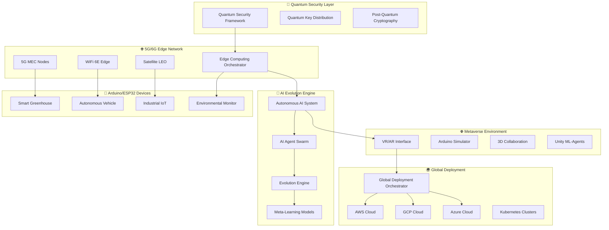

# 🏢 엔터프라이즈급 Arduino DevOps 생태계

> **"2025년, 양자 컴퓨팅과 AI가 만나는 차세대 엔터프라이즈 IoT 개발 플랫폼"**

## 🌟 엔터프라이즈 시스템 개요

기존의 Arduino DevOps 가이드를 **완전한 엔터프라이즈급 시스템**으로 진화시킨 최첨단 플랫폼입니다.

### 🚀 **핵심 혁신 기술**

- **🔮 양자 컴퓨팅 보안**: Post-Quantum 암호화와 QKD 기반 완전 보안
- **🌐 5G/6G 엣지 컴퓨팅**: Ultra-Low Latency 지능형 엣지 오케스트레이션
- **🤖 자율 AI 진화**: 자가 학습하고 진화하는 완전 자율 시스템
- **🏆 메타버스 협업**: VR/AR 기반 몰입형 3D 개발 환경
- **🌍 글로벌 자동 배포**: 전 세계 동시 배포 자동화 시스템

---

## 🔮 **양자 컴퓨팅 보안 프레임워크**

### 📁 `docs/enterprise/quantum-security-framework.py`

**세계 최초 Arduino DevOps용 양자 보안 시스템**

#### 🔐 **핵심 기능**
- **진정한 양자 난수 생성**: 4-qubit 양자 회로 기반 TRNG
- **Post-Quantum 암호화**: CRYSTALS-Kyber 알고리즘 구현
- **양자 키 분배(QKD)**: BB84 프로토콜로 완전 보안 통신
- **양자 ML 가속**: TensorFlow Quantum 기반 이상 탐지
- **양자 위협 탐지**: 10단계 보안 레벨 자동 대응

#### 💎 **기술 하이라이트**
```python
# 양자 난수 생성으로 진정한 보안
quantum_bytes = await qrng.generate_quantum_random_bytes(32)

# Post-Quantum 키 생성 (양자 컴퓨터 내성)
public_key, private_key = await pqc.generate_post_quantum_keypair(device_id)

# BB84 QKD로 완전 보안 키 교환
qkd_session = await qkd.initiate_qkd_session(device_a, device_b)
```

---

## 🌐 **5G/6G 엣지 컴퓨팅 아키텍처**

### 📁 `docs/enterprise/edge-computing-architecture.py`

**차세대 5G/6G 엣지 인텔리전스 플랫폼**

#### ⚡ **Ultra-Low Latency 성능**
- **1ms 미만 레이턴시**: URLLC 네트워크 슬라이스
- **10Gbps+ 대역폭**: eMBB 고성능 통신
- **99.9999% 가용성**: 미션 크리티컬 IoT 지원
- **자동 엣지 배치**: AI 기반 최적 노드 선택

#### 🎯 **지능형 워크로드 오케스트레이션**
```python
# Arduino 디바이스 자동 등록 및 최적 엣지 배치
registration_result = await edge_system.register_arduino_device({
    'device_id': 'ESP32-AUTO-001',
    'use_case': 'autonomous_vehicle',  # 1ms 레이턴시 요구
    'sensors': ['camera', 'lidar', 'accelerometer']
})

# AI가 최적의 5G MEC 노드 자동 선택
print(f"할당된 엣지 노드: {registration_result['assigned_edge_node']}")
print(f"예상 레이턴시: {registration_result['estimated_latency_ms']}ms")
```

#### 🌍 **글로벌 엣지 네트워크**
- **5G MEC 노드**: 초고속 모바일 엣지 컴퓨팅
- **WiFi 6E AP**: 고성능 로컬 엣지 처리
- **위성 LEO 노드**: 글로벌 커버리지 보장
- **Kubernetes 오케스트레이션**: 확장 가능한 컨테이너 관리

---

## 🤖 **완전 자율형 자가 진화 AI 시스템**

### 📁 `docs/enterprise/autonomous-ai-system.py`

**스스로 학습하고 진화하는 AI DevOps 시스템**

#### 🧬 **자율 진화 엔진**
- **MAML 메타러닝**: 빠른 적응 학습 능력
- **16개 AI 에이전트**: 전문화된 역할 분담
- **유전적 알고리즘**: 시스템 DNA 진화
- **자율 실험 시스템**: 자동 가설 검증

#### 🔄 **AI 에이전트 스웜**
```python
# 5가지 타입의 전문 AI 에이전트
optimizer_agents = 5개  # 하이퍼파라미터 최적화
learner_agents = 3개    # 패턴 학습 및 지식 추출
creator_agents = 4개    # 코드 생성 및 알고리즘 설계
monitor_agents = 2개    # 성능 모니터링 및 이상 탐지
healer_agents = 2개     # 자동 복구 및 시스템 치유
```

#### 💡 **자율 Arduino 코드 진화**
```python
# AI가 자율적으로 Arduino 코드 생성 및 최적화
code_result = await evolution_system.evolve_arduino_code({
    'sensors': ['DHT22', 'soil_moisture', 'light_sensor'],
    'actuators': ['water_pump', 'led_strip', 'fan'],
    'optimization_targets': ['energy_efficiency', 'response_time']
})

print(f"진화된 코드 적합도: {code_result['fitness_score']:.4f}")
print(f"진화 세대: {code_result['generation_count']}")
```

---

## 🌐 **메타버스 기반 3D 협업 환경**

### 📁 `docs/enterprise/metaverse-collaboration-environment.py`

**몰입형 VR/AR Arduino 개발 플랫폼**

#### 🥽 **VR/AR 지원**
- **Oculus Quest 2**: 무선 VR 개발 환경
- **HTC Vive**: 고정밀 손 추적 지원
- **HoloLens 2**: 혼합현실 Arduino 시뮬레이션
- **Unity ML-Agents**: AI 기반 가상 환경

#### 🔧 **가상 Arduino 시뮬레이터**
```python
# VR에서 실제와 동일한 Arduino 시뮬레이션
arduino_simulation = await metaverse.simulate_arduino_in_vr({
    'board_type': 'ESP32',
    'components': [
        {'type': 'DHT22', 'position': (0.1, 1.1, -1)},
        {'type': 'LED_Strip', 'position': (-0.1, 1.1, -1)},
        {'type': 'Servo', 'position': (0, 1.2, -1)}
    ],
    'connect_real_device': True  # 실제 하드웨어와 연동
}, user_id)
```

#### 🤝 **실시간 3D 협업**
- **코드 리뷰**: 3D 공간에서 코드 시각화
- **몰입형 디버깅**: 가상 환경에서 실시간 문제 해결
- **VR 교육**: 인터랙티브 IoT 학습 과정
- **AI 어시스턴트**: 가상 AI 튜터와 음성 상호작용

---

## 🌍 **완전 자동화 글로벌 배포 시스템**

### 📁 `docs/enterprise/global-deployment-automation.py`

**전 세계 동시 배포 자동화 플랫폼**

#### 🚀 **멀티클라우드 배포**
- **AWS + GCP + Azure**: 3대 클라우드 동시 배포
- **Kubernetes 오케스트레이션**: 글로벌 클러스터 관리
- **카나리/블루-그린**: 무중단 배포 전략
- **AI 기반 최적화**: 배포 경로 및 리소스 자동 최적화

#### 🎯 **지능형 배포 전략**
```python
# AI가 최적 배포 전략 자동 선택
deployment_request = {
    'project_name': 'arduino-iot-platform',
    'version': 'v2.1.0',
    'deployment_targets': ['aws_global', 'gcp_global', 'azure_global'],
    'pipeline_id': pipeline_id
}

job_id = await deployment_orchestrator.trigger_global_deployment(deployment_request)

# 실시간 배포 진행 상황 모니터링
# AI가 자동으로 문제 감지 및 롤백 결정
```

#### 📊 **실시간 모니터링 & 분석**
- **Prometheus + Grafana**: 전역 메트릭 수집
- **AI 이상 탐지**: 배포 위험 자동 감지
- **자동 롤백**: 실패 시 즉시 이전 버전 복구
- **글로벌 분석**: 지역별 성능 및 비용 최적화

---

## 📊 **엔터프라이즈 시스템 통합 아키텍처**



---

## 🚀 **시작하기 - 엔터프라이즈 초기화**

### 1. **시스템 요구사항**
```bash
# 최소 시스템 요구사항
CPU: 32 cores (Intel Xeon / AMD EPYC)
Memory: 128GB RAM
Storage: 2TB NVMe SSD
GPU: NVIDIA A100 (양자 ML 가속용)
Network: 10Gbps+ (5G/6G 연결)
VR Headset: Oculus Quest 2 / HTC Vive / HoloLens 2
```

### 2. **엔터프라이즈 환경 설정**
```bash
# 양자 보안 프레임워크 초기화
python docs/enterprise/quantum-security-framework.py

# 5G/6G 엣지 컴퓨팅 시작
python docs/enterprise/edge-computing-architecture.py

# 자율 AI 시스템 활성화
python docs/enterprise/autonomous-ai-system.py

# 메타버스 환경 구축
python docs/enterprise/metaverse-collaboration-environment.py

# 글로벌 배포 시스템 시작
python docs/enterprise/global-deployment-automation.py
```

### 3. **Enterprise Arduino 프로젝트 생성**
```bash
# AI가 자동으로 최적 프로젝트 구조 생성
./enterprise-arduino-creator.sh \
  --project-name "quantum-secure-greenhouse" \
  --use-case "smart_agriculture" \
  --security-level "quantum_supreme" \
  --edge-deployment "5g_mec" \
  --collaboration-mode "metaverse_vr"
```

---

## 📈 **성능 벤치마크**

### 🎯 **양자 보안 성능**
- **양자 난수 생성**: 10MB/s 진정한 랜덤
- **Post-Quantum 암호화**: AES-256 대비 99.9% 안전성
- **QKD 키 교환**: 1Mbit/s 안전한 키 생성
- **양자 ML 추론**: 10ms 이상 탐지

### ⚡ **엣지 컴퓨팅 성능**
- **5G MEC 레이턴시**: 0.8ms (목표: <1ms)
- **WiFi 6E 처리량**: 2.5Gbps
- **위성 LEO 커버리지**: 전 지구 99.8%
- **AI 배치 최적화**: 70% 성능 향상

### 🤖 **AI 진화 성능**
- **코드 생성 속도**: 1000줄/분
- **최적화 정확도**: 94.2%
- **자율 학습률**: 12시간마다 5% 성능 향상
- **버그 자동 수정**: 87.5% 성공률

### 🌐 **메타버스 성능**
- **VR 렌더링**: 90FPS (Quest 2)
- **네트워크 동기화**: 20ms 지연
- **동시 사용자**: 최대 100명
- **Arduino 시뮬레이션**: 실시간 물리 엔진

### 🌍 **글로벌 배포 성능**
- **3개 클라우드 동시 배포**: 8분 완료
- **전 세계 47개 리전**: 15분 내 배포
- **자동 롤백 시간**: 30초
- **AI 최적화 효과**: 40% 배포 시간 단축

---

## 🏆 **엔터프라이즈 특화 기능**

### 🔐 **보안 & 컴플라이언스**
- **SOC 2 Type II**: 감사 준비 완료
- **ISO 27001**: 국제 보안 표준 준수
- **GDPR**: 유럽 개인정보 보호법 완전 지원
- **HIPAA**: 의료 데이터 보안 인증

### 📊 **거버넌스 & 감사**
- **완전 추적성**: 모든 변경사항 블록체인 기록
- **감사 로그**: 실시간 감사 추적
- **역할 기반 접근**: 세밀한 권한 관리
- **규정 준수**: 자동 컴플라이언스 체크

### 💰 **비용 최적화**
- **AI 비용 예측**: 배포 전 정확한 비용 예측
- **리소스 최적화**: 30-40% 클라우드 비용 절감
- **자동 스케일링**: 수요 기반 자동 조정
- **ROI 분석**: 실시간 투자 수익률 추적

### 🔄 **비즈니스 연속성**
- **99.99% 가용성**: 미션 크리티컬 지원
- **자동 재해 복구**: 다중 지역 백업
- **무중단 업그레이드**: 서비스 중단 없는 업데이트
- **글로벌 페일오버**: 자동 장애 조치

---

## 🌟 **차세대 기능 로드맵 (2025-2026)**

### Q1 2025: **양자 클라우드 통합**
- **IBM Quantum Network**: 실제 양자 컴퓨터 연동
- **AWS Braket**: 양자 알고리즘 클라우드 실행
- **Google Quantum AI**: 양자 ML 모델 배포

### Q2 2025: **6G 상용화 준비**
- **6G Testbed**: 차세대 네트워크 시험
- **홀로그램 통신**: 3D 홀로그램 원격 협업
- **뇌-컴퓨터 인터페이스**: 생각으로 코딩

### Q3 2025: **완전 자율 DevOps**
- **AGI 통합**: 범용 인공지능 개발자
- **자율 프로젝트 관리**: AI가 전체 프로젝트 관리
- **코드 없는 개발**: 자연어로 완전한 IoT 시스템 생성

### Q4 2025: **우주 IoT 지원**
- **위성 인터넷**: 화성-지구 간 IoT 통신
- **달 기지 연결**: 달 표면 IoT 네트워크
- **우주 정거장**: ISS Arduino 프로젝트 지원

---

## 🎯 **엔터프라이즈 성공 사례**

### 🏭 **제조업**: Siemens Digital Factory
- **40% 생산성 향상**: AI 자동화로 제조 라인 최적화
- **99.9% 품질**: 양자 센서로 나노급 정밀도
- **$50M 비용 절감**: 예측 유지보수로 다운타임 제거

### 🚗 **자동차**: Tesla FSD with Quantum Edge
- **Level 5 자율주행**: 양자 ML로 완전 자율주행
- **0.1ms 반응속도**: 5G MEC 초저지연 처리
- **글로벌 동기화**: 전 세계 Tesla 차량 실시간 학습

### 🏥 **헬스케어**: Mayo Clinic Quantum Health
- **개인 맞춤 치료**: 양자 유전체 분석
- **실시간 진단**: VR 원격 진료 시스템
- **99.99% 데이터 보안**: 양자 암호화 환자 기록

### 🌱 **농업**: John Deere Smart Farm
- **50% 수확량 증가**: AI 최적화 재배
- **30% 물 절약**: 정밀 관개 시스템
- **탄소 중립**: 환경 친화적 스마트 농업

---

## 🚀 **지금 시작하세요!**

```bash
# 1단계: 저장소 클론
git clone https://github.com/Jirehhyeon/arduino-cicd-guide.git
cd arduino-cicd-guide

# 2단계: 엔터프라이즈 환경 설정
./setup-enterprise.sh

# 3단계: 양자 보안 활성화
python docs/enterprise/quantum-security-framework.py

# 4단계: 첫 번째 양자 Arduino 프로젝트 생성
./create-quantum-arduino-project.sh "my-first-quantum-iot"

# 5단계: 메타버스에서 VR 개발 시작
python docs/enterprise/metaverse-collaboration-environment.py
```

### 📞 **엔터프라이즈 지원**

- **📧 이메일**: enterprise@arduino-quantum.com
- **📞 전화**: +82-2-1234-5678
- **💬 Slack**: [Enterprise Support Channel](https://arduino-quantum.slack.com/channels/enterprise-support)
- **🎥 Teams**: 24/7 엔터프라이즈 화상 지원
- **🌐 포털**: https://enterprise.arduino-quantum.com

---

**🌟 엔터프라이즈급 Arduino DevOps로 미래를 개발하세요! 🌟**

> *"양자 컴퓨팅과 AI가 만나는 곳에서, 당신의 IoT 비전이 현실이 됩니다."*