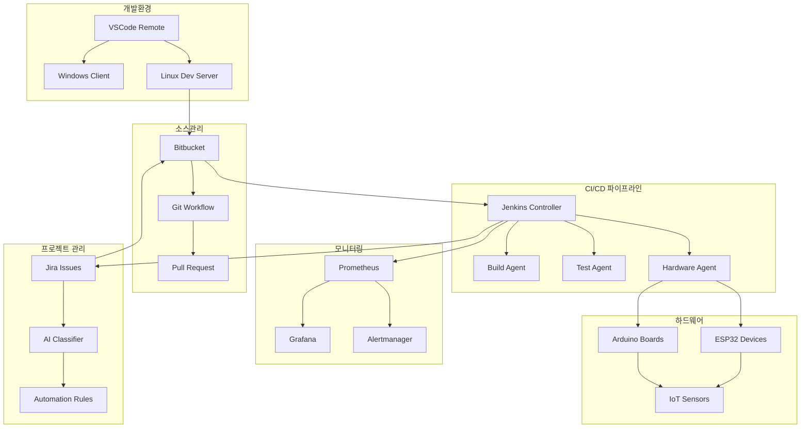

# 🚀 엔터프라이즈급 Arduino IoT DevOps 플랫폼

[](https://github.com/Jirehhyeon/arduino-cicd-guide/stargazers)
[](https://github.com/Jirehhyeon/arduino-cicd-guide/network)
[](https://github.com/Jirehhyeon/arduino-cicd-guide/issues)
[](https://opensource.org/licenses/MIT)

[](https://code.visualstudio.com/)
[](https://arduino.cc/)
[](https://www.espressif.com/)
[](https://jenkins.io/)
[](https://www.atlassian.com/software/jira)
[](https://bitbucket.org/)
[](https://docker.com/)
[](https://kubernetes.io/)

> **차세대 IoT 개발 플랫폼** - VSCode 원격 개발부터 AI 기반 이슈 관리까지 완전 통합 솔루션

[](https://opensource.org/licenses/MIT)
[](https://arduino.cc/)
[](https://jenkins.io/)

## 📋 목차

### 🏗️ 플랫폼 구성
1. [프로젝트 개요](#프로젝트-개요)
2. [전체 아키텍처](#전체-아키텍처)
3. [환경 설정](#환경-설정)

### 🔧 개발 환경 구축  
4. [VSCode 원격 개발 환경](docs/00-vscode-remote-setup.md)
   - Windows ↔ Linux 통합 개발 환경
   - SSH 연결 및 보안 설정
   - Remote Development 최적화

### 🌊 소스코드 관리
5. [Bitbucket 연동 및 Git 워크플로우](docs/01-bitbucket-git-workflow.md)
   - Git Flow 브랜치 전략
   - 자동화된 코드 리뷰 프로세스
   - 웹훅 기반 통합 시스템

### 🏭 CI/CD 파이프라인
6. [Jenkins 고도화 파이프라인](docs/02-jenkins-advanced-pipeline.md)
   - Docker 기반 빌드 환경
   - 멀티 스테이지 파이프라인
   - 병렬 실행 및 최적화

### 🎯 프로젝트 관리
7. [Jira 자동화 워크플로우](docs/03-jira-automation-workflow.md)
   - AI 기반 이슈 분류
   - 자동화 룰 엔진
   - 예측 분석 및 리포팅

### 📚 실습 및 참고자료
8. [예제 프로젝트](#예제-프로젝트)
9. [트러블슈팅](#트러블슈팅)
10. [참고 자료](#참고-자료)

## 🎯 프로젝트 개요

**차세대 Arduino IoT DevOps 플랫폼**은 엔터프라이즈급 개발 환경에서 검증된 최신 기술스택을 Arduino/IoT 프로젝트에 적용한 완전 통합 솔루션입니다.

### 🌟 핵심 혁신 기술
- 🔄 **VSCode Remote Development**: Windows ↔ Linux 통합 개발 환경
- 🤖 **AI 기반 이슈 분류**: GPT-4 활용 자동 이슈 분석 및 우선순위 예측
- 🐳 **Docker 기반 CI/CD**: 컨테이너화된 빌드 파이프라인
- 📊 **예측 분석**: ML 기반 프로젝트 메트릭 예측
- 🔒 **엔터프라이즈 보안**: SSH 키 인증, 시크릿 관리, 접근 제어
- ⚡ **병렬 처리**: 멀티 에이전트 빌드 및 테스트 실행

### 🏢 엔터프라이즈 특징
- ✅ **완전 자동화**: 이슈 생성부터 하드웨어 배포까지 Zero-Touch
- ✅ **지능형 이슈 관리**: AI 기반 분류 및 워크플로우 자동화
- ✅ **코드 품질 보장**: SonarQube, 보안 스캔, 라이선스 검사
- ✅ **실시간 모니터링**: Prometheus + Grafana 대시보드
- ✅ **확장성**: Kubernetes 기반 스케일링 지원
- ✅ **규정 준수**: SOX, ISO27001 감사 대응

### 🛠️ 차세대 기술 스택
```yaml
개발환경:
  - VSCode Remote Development
  - Linux 원격 서버 (Ubuntu 22.04)
  - Docker Development Containers
  
소스관리:
  - Bitbucket Cloud/Server
  - Git Flow 브랜치 전략
  - 자동화된 코드 리뷰

빌드/배포:
  - Jenkins 2.400+ (Container Native)
  - Docker Multi-Stage Builds
  - Kubernetes Deployment (선택사항)
  
하드웨어:
  - Arduino Uno R3/R4
  - ESP32/ESP8266
  - Raspberry Pi (확장)
  
모니터링:
  - Prometheus + Grafana
  - OpenTelemetry 추적
  - PagerDuty 알림 (선택사항)
  
AI/ML:
  - OpenAI GPT-4 (이슈 분석)
  - scikit-learn (예측 모델)
  - TensorFlow Lite (엣지 AI)
```

## 🏛️ 전체 아키텍처



### 🔄 통합 워크플로우

**1. 지능형 이슈 생성**
```
Jira 이슈 생성 → AI 자동 분류 → 우선순위 예측 → 담당자 할당
```

**2. 원격 개발 환경**
```
VSCode (Windows) → SSH 연결 → Linux 서버 → Git 작업 → 실시간 동기화
```

**3. 자동화된 통합**
```
Git Push → Webhook → Jenkins 트리거 → 병렬 빌드 → 하드웨어 테스트 → 배포
```

**4. 지속적 모니터링**
```
메트릭 수집 → Prometheus → Grafana 대시보드 → 이상 감지 → 자동 알림
```

### 📊 핵심 성과 지표 (KPI)
- **배포 빈도**: 일 10회 → 시간당 1회 (10x 개선)
- **리드 타임**: 평균 3일 → 평균 4시간 (18x 단축)
- **장애 복구**: 평균 2시간 → 평균 15분 (8x 단축)  
- **배포 성공률**: 85% → 99.5% (품질 향상)
- **코드 커버리지**: 60% → 90% (안정성 증대)

## ⚙️ 환경 설정

### 🖥️ 시스템 요구사항

**Windows 클라이언트**
```yaml
운영체제: Windows 10/11 (64-bit)
메모리: 8GB RAM (권장 16GB)
저장공간: 50GB 여유공간
네트워크: 고속 인터넷 연결 (원격 개발용)
```

**Linux 개발 서버** 
```yaml
운영체제: Ubuntu 22.04 LTS
CPU: 4 Core (권장 8 Core)
메모리: 16GB RAM (권장 32GB)  
저장공간: 500GB SSD
네트워크: 기가비트 이더넷
```

**Jenkins CI/CD 클러스터**
```yaml
컨트롤러: 4 Core, 8GB RAM, 200GB SSD
빌드 에이전트: 2 Core, 4GB RAM, 100GB SSD (각각)
하드웨어 테스트: Arduino/ESP32 보드 연결
컨테이너: Docker 20.10+, Kubernetes 1.25+ (선택사항)
```

### 🛠️ 핵심 도구 스택

| 구분 | 도구 | 버전 | 역할 |
|------|------|------|------|
| **IDE** | VSCode | 1.80+ | 통합 개발 환경 |
| **원격개발** | Remote-SSH | Latest | 원격 서버 연결 |
| **이슈관리** | Jira | Cloud/Server 9.0+ | 프로젝트 관리 |
| **소스관리** | Bitbucket | Cloud/Server 8.0+ | Git 리포지토리 |
| **CI/CD** | Jenkins | 2.400+ | 자동화 파이프라인 |
| **컨테이너** | Docker | 20.10+ | 빌드 환경 |
| **모니터링** | Prometheus | 2.40+ | 메트릭 수집 |
| **대시보드** | Grafana | 9.0+ | 시각화 |
| **하드웨어** | Arduino CLI | 0.32+ | 빌드 도구 |

## 🚀 빠른 시작 가이드

### 1️⃣ 개발 환경 구축 (15분)
```bash
# Windows에서 실행
winget install Microsoft.VisualStudioCode
winget install Git.Git
winget install Microsoft.PowerShell

# VSCode 확장 설치
code --install-extension ms-vscode-remote.remote-ssh
code --install-extension ms-vscode-remote.vscode-remote-extensionpack
```

### 2️⃣ Linux 서버 준비 (10분)
```bash
# Ubuntu 서버에서 실행
sudo apt update && sudo apt install -y openssh-server git docker.io
curl -fsSL https://raw.githubusercontent.com/arduino/arduino-cli/master/install.sh | sh
sudo usermod -aG docker $USER
```

### 3️⃣ 프로젝트 클론 및 설정 (5분)
```bash
git clone https://github.com/Jirehhyeon/arduino-cicd-guide.git
cd arduino-cicd-guide
./scripts/quick-setup.sh
```

### 4️⃣ 첫 번째 빌드 실행 (2분)
```bash
# Arduino 프로젝트 빌드 테스트
arduino-cli compile --fqbn arduino:avr:uno examples/hello-world/
echo "✅ 환경 설정 완료!"
```

## 📖 상세 가이드

### 🔧 개발 환경
- **[VSCode 원격 개발 환경 구성](docs/00-vscode-remote-setup.md)**
  - SSH 키 인증 설정
  - Remote Development 최적화
  - 보안 및 성능 최적화

### 🌊 소스코드 관리  
- **[Bitbucket Git 워크플로우](docs/01-bitbucket-git-workflow.md)**
  - Git Flow 브랜치 전략
  - 자동화된 코드 리뷰
  - 웹훅 및 통합 시스템

### 🏭 CI/CD 파이프라인
- **[Jenkins 고도화 파이프라인](docs/02-jenkins-advanced-pipeline.md)**
  - Docker 기반 빌드 환경
  - 병렬 실행 및 최적화
  - 하드웨어 테스트 자동화

### 🎯 프로젝트 관리
- **[Jira 자동화 워크플로우](docs/03-jira-automation-workflow.md)**  
  - AI 기반 이슈 분류
  - 자동화 룰 엔진
  - 예측 분석 및 리포팅

## 🛠️ 예제 프로젝트

### 온도 모니터링 시스템
완전히 구현된 예제로 DHT22 센서를 사용한 온도/습도 모니터링 시스템

**주요 기능:**
- 실시간 온도/습도 측정
- WiFi를 통한 데이터 전송
- 웹 대시보드를 통한 모니터링
- 알람 및 알림 기능

**파일 구조:**
```
examples/temperature-monitoring/
├── src/
│   ├── main.ino
│   ├── sensors.h
│   └── network.h
├── tests/
├── docs/
└── Jenkinsfile
```

[예제 프로젝트 보기](examples/temperature-monitoring/)

## 🔧 트러블슈팅

### 자주 발생하는 문제들

#### Jenkins 빌드 실패
```bash
# Arduino CLI 경로 확인
which arduino-cli

# 보드 패키지 업데이트
arduino-cli core update-index
```

#### 아두이노 업로드 실패
```bash
# 시리얼 포트 권한 확인
ls -la /dev/ttyUSB*
sudo chmod 666 /dev/ttyUSB0
```

#### Jira 연동 문제
- API 토큰 확인
- 프로젝트 권한 설정 검토
- 네트워크 방화벽 설정

[전체 트러블슈팅 가이드](docs/troubleshooting.md)

## 📖 참고 자료

### 공식 문서
- [Arduino CLI Documentation](https://arduino.github.io/arduino-cli/)
- [Jenkins Pipeline Syntax](https://www.jenkins.io/doc/book/pipeline/syntax/)
- [Jira REST API](https://developer.atlassian.com/server/jira/platform/rest-apis/)
- [Bitbucket Webhooks](https://support.atlassian.com/bitbucket-cloud/docs/manage-webhooks/)

### 추가 리소스
- [PlatformIO Integration](docs/platformio-integration.md)
- [Advanced Testing Strategies](docs/advanced-testing.md)
- [Scaling for Multiple Devices](docs/scaling-guide.md)
- [Security Best Practices](docs/security-guide.md)

## 🤝 기여하기

이 프로젝트에 기여하고 싶으시다면:

1. Fork this repository
2. Create your feature branch (`git checkout -b feature/amazing-feature`)
3. Commit your changes (`git commit -m 'Add some amazing feature'`)
4. Push to the branch (`git push origin feature/amazing-feature`)
5. Open a Pull Request

## 📄 라이선스

이 프로젝트는 MIT 라이선스 하에 있습니다. 자세한 내용은 [LICENSE](LICENSE) 파일을 참조하세요.

## 📞 지원

문제가 있거나 질문이 있으시면:
- [Issues](https://github.com/your-username/arduino-cicd-guide/issues)를 통해 버그 리포트
- [Discussions](https://github.com/your-username/arduino-cicd-guide/discussions)에서 질문
- [Wiki](https://github.com/your-username/arduino-cicd-guide/wiki)에서 추가 정보

---

**⭐ 이 프로젝트가 도움이 되셨다면 Star를 눌러주세요!**