# 🚀 아두이노 프로젝트 완전 CI/CD 가이드

[](https://github.com/YOUR-USERNAME/arduino-cicd-guide/stargazers)
[](https://github.com/YOUR-USERNAME/arduino-cicd-guide/network)
[](https://github.com/YOUR-USERNAME/arduino-cicd-guide/issues)
[](https://opensource.org/licenses/MIT)

[](https://arduino.cc/)
[](https://www.espressif.com/)
[](https://jenkins.io/)
[](https://www.atlassian.com/software/jira)
[](https://bitbucket.org/)

> 소스코드 작성부터 배포까지 - Jira, Jenkins, Bitbucket을 활용한 완전 자동화

[](https://opensource.org/licenses/MIT)
[](https://arduino.cc/)
[](https://jenkins.io/)

## 📋 목차

1. [프로젝트 개요](#프로젝트-개요)
2. [전체 워크플로우](#전체-워크플로우)
3. [환경 설정](#환경-설정)
4. [단계별 가이드](#단계별-가이드)
   - [1단계: 프로젝트 초기 설정](#1단계-프로젝트-초기-설정)
   - [2단계: Jira 설정](#2단계-jira-설정)
   - [3단계: Bitbucket 리포지토리 설정](#3단계-bitbucket-리포지토리-설정)
   - [4단계: Jenkins CI/CD 파이프라인](#4단계-jenkins-cicd-파이프라인)
   - [5단계: 개발 프로세스](#5단계-개발-프로세스)
   - [6단계: 배포 및 모니터링](#6단계-배포-및-모니터링)
5. [예제 프로젝트](#예제-프로젝트)
6. [트러블슈팅](#트러블슈팅)
7. [참고 자료](#참고-자료)

## 🎯 프로젝트 개요

이 가이드는 아두이노 IoT 프로젝트를 전문적으로 관리하고 배포하는 완전한 DevOps 파이프라인을 제공합니다.

### 주요 특징
- ✅ **완전 자동화**: 코드 커밋부터 하드웨어 업로드까지
- ✅ **이슈 관리**: Jira를 통한 체계적인 작업 관리
- ✅ **코드 품질**: 자동 빌드, 테스트, 코드 리뷰
- ✅ **실시간 모니터링**: 배포 상태 및 디바이스 상태 추적
- ✅ **확장 가능**: 다중 보드, 다중 환경 지원

### 사용 기술 스택
- **하드웨어**: Arduino Uno/ESP32
- **개발**: Arduino IDE, PlatformIO
- **이슈 관리**: Jira
- **소스 관리**: Bitbucket Git
- **CI/CD**: Jenkins
- **모니터링**: Prometheus + Grafana (선택사항)

## 🔄 전체 워크플로우

```mermaid
graph LR
    A[개발자] --> B[Jira 이슈]
    B --> C[Bitbucket 코딩]
    C --> D[Jenkins 빌드]
    D --> E[테스트 실행]
    E --> F[아두이노 업로드]
    F --> G[상태 업데이트]
    G --> B
```



### 프로세스 흐름
1. **계획**: Jira에서 이슈 생성 및 할당
2. **개발**: Bitbucket에서 브랜치 생성 및 코딩
3. **통합**: Pull Request를 통한 코드 리뷰
4. **빌드**: Jenkins 자동 빌드 및 테스트
5. **배포**: 성공 시 아두이노 보드에 자동 업로드
6. **피드백**: Jira 이슈 상태 자동 업데이트

## ⚙️ 환경 설정

### 필수 도구
- **Jira**: 이슈 및 프로젝트 관리
- **Bitbucket**: Git 리포지토리
- **Jenkins**: CI/CD 서버
- **Arduino CLI**: 커맨드라인 빌드 도구

### 시스템 요구사항
- Ubuntu 18.04+ 또는 Windows 10+
- Jenkins 2.400+
- Arduino CLI 0.30+
- Git 2.20+

## 📚 단계별 가이드

### [1단계: 프로젝트 초기 설정](docs/01-project-setup.md)
- 프로젝트 구조 생성
- 아두이노 환경 설정
- 기본 스케치 작성

### [2단계: Jira 설정](docs/02-jira-setup.md)
- 프로젝트 생성 및 설정
- 이슈 타입 및 워크플로우
- 사용자 권한 관리

### [3단계: Bitbucket 리포지토리 설정](docs/03-bitbucket-setup.md)
- 리포지토리 생성 및 초기화
- 브랜치 전략 설정
- 웹훅 설정

### [4단계: Jenkins CI/CD 파이프라인](docs/04-jenkins-pipeline.md)
- Jenkins 설치 및 플러그인
- Jenkinsfile 작성
- 빌드 및 배포 자동화

### [5단계: 개발 프로세스](docs/05-development-process.md)
- 이슈 기반 개발 프로세스
- 코드 리뷰 가이드라인
- 테스트 작성 방법

### [6단계: 배포 및 모니터링](docs/06-deployment-monitoring.md)
- 자동 배포 설정
- 실시간 모니터링
- 오류 추적 및 알림

## 🛠️ 예제 프로젝트

### 온도 모니터링 시스템
완전히 구현된 예제로 DHT22 센서를 사용한 온도/습도 모니터링 시스템

**주요 기능:**
- 실시간 온도/습도 측정
- WiFi를 통한 데이터 전송
- 웹 대시보드를 통한 모니터링
- 알람 및 알림 기능

**파일 구조:**
```
examples/temperature-monitoring/
├── src/
│   ├── main.ino
│   ├── sensors.h
│   └── network.h
├── tests/
├── docs/
└── Jenkinsfile
```

[예제 프로젝트 보기](examples/temperature-monitoring/)

## 🔧 트러블슈팅

### 자주 발생하는 문제들

#### Jenkins 빌드 실패
```bash
# Arduino CLI 경로 확인
which arduino-cli

# 보드 패키지 업데이트
arduino-cli core update-index
```

#### 아두이노 업로드 실패
```bash
# 시리얼 포트 권한 확인
ls -la /dev/ttyUSB*
sudo chmod 666 /dev/ttyUSB0
```

#### Jira 연동 문제
- API 토큰 확인
- 프로젝트 권한 설정 검토
- 네트워크 방화벽 설정

[전체 트러블슈팅 가이드](docs/troubleshooting.md)

## 📖 참고 자료

### 공식 문서
- [Arduino CLI Documentation](https://arduino.github.io/arduino-cli/)
- [Jenkins Pipeline Syntax](https://www.jenkins.io/doc/book/pipeline/syntax/)
- [Jira REST API](https://developer.atlassian.com/server/jira/platform/rest-apis/)
- [Bitbucket Webhooks](https://support.atlassian.com/bitbucket-cloud/docs/manage-webhooks/)

### 추가 리소스
- [PlatformIO Integration](docs/platformio-integration.md)
- [Advanced Testing Strategies](docs/advanced-testing.md)
- [Scaling for Multiple Devices](docs/scaling-guide.md)
- [Security Best Practices](docs/security-guide.md)

## 🤝 기여하기

이 프로젝트에 기여하고 싶으시다면:

1. Fork this repository
2. Create your feature branch (`git checkout -b feature/amazing-feature`)
3. Commit your changes (`git commit -m 'Add some amazing feature'`)
4. Push to the branch (`git push origin feature/amazing-feature`)
5. Open a Pull Request

## 📄 라이선스

이 프로젝트는 MIT 라이선스 하에 있습니다. 자세한 내용은 [LICENSE](LICENSE) 파일을 참조하세요.

## 📞 지원

문제가 있거나 질문이 있으시면:
- [Issues](https://github.com/your-username/arduino-cicd-guide/issues)를 통해 버그 리포트
- [Discussions](https://github.com/your-username/arduino-cicd-guide/discussions)에서 질문
- [Wiki](https://github.com/your-username/arduino-cicd-guide/wiki)에서 추가 정보

---

**⭐ 이 프로젝트가 도움이 되셨다면 Star를 눌러주세요!**