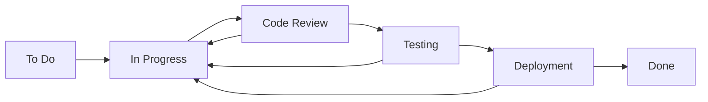

# 2단계: Jira 설정

## 📋 개요
아두이노 프로젝트 관리를 위한 Jira 환경을 설정하고 최적화합니다.

## 🚀 Jira 프로젝트 생성

### 1. 새 프로젝트 만들기

1. **Jira 접속** 후 "프로젝트 만들기" 클릭
2. **프로젝트 템플릿 선택**: "스크럼" 또는 "칸반" 선택
3. **프로젝트 정보 입력**:
   - 프로젝트 이름: `Arduino IoT Project`
   - 프로젝트 키: `AIP`
   - 프로젝트 유형: `팀 관리 프로젝트`

### 2. 프로젝트 설정

**기본 설정**:
```
프로젝트 이름: Arduino IoT Project
프로젝트 키: AIP
프로젝트 리더: [본인]
기본 담당자: [팀 멤버]
```

## 🎯 이슈 타입 설정

### 기본 이슈 타입
- **Epic**: 큰 기능 단위 (예: "온도 모니터링 시스템")
- **Story**: 사용자 스토리 (예: "사용자가 실시간 온도를 볼 수 있다")
- **Task**: 개발 작업 (예: "DHT22 센서 라이브러리 구현")
- **Bug**: 버그 수정 (예: "센서 읽기 오류 수정")
- **Improvement**: 개선 사항 (예: "배터리 효율성 향상")

### 커스텀 이슈 타입 추가

1. **프로젝트 설정** → **이슈 타입**
2. **새 이슈 타입 추가**:

```
Hardware Issue (하드웨어 이슈)
- 아이콘: 🔧
- 설명: 하드웨어 관련 문제 및 개선사항

Deployment (배포)
- 아이콘: 🚀
- 설명: 배포 관련 작업

Documentation (문서화)
- 아이콘: 📝
- 설명: 문서 작성 및 업데이트

Testing (테스트)
- 아이콘: 🧪
- 설명: 테스트 케이스 작성 및 실행
```

## ⚡ 워크플로우 설정

### 기본 워크플로우 구성


### 상태 정의

1. **To Do** (할 일)
   - 새로 생성된 이슈
   - 아직 작업 시작 안함

2. **In Progress** (진행 중)
   - 개발자가 작업 중
   - Git 브랜치 생성 완료

3. **Code Review** (코드 리뷰)
   - Pull Request 생성됨
   - 코드 리뷰 진행 중

4. **Testing** (테스트)
   - Jenkins 빌드 진행 중
   - 자동/수동 테스트 실행

5. **Deployment** (배포)
   - 아두이노 보드에 업로드
   - 현장 테스트 진행

6. **Done** (완료)
   - 모든 작업 완료
   - 검증 완료

### 워크플로우 전환 규칙

**자동 전환 (Jenkins에서 처리)**:
```yaml
Git Push → "In Progress"
PR 생성 → "Code Review"
빌드 성공 → "Testing"
배포 성공 → "Deployment"
테스트 완료 → "Done"
```

**수동 전환**:
- 개발자가 작업 시작시 "To Do" → "In Progress"
- 문제 발견시 이전 단계로 되돌리기

## 🏗️ 프로젝트 구조 설정

### Epic 구조 예시

```
Epic: 온도 모니터링 시스템 (AIP-1)
├── Story: 온도 센서 데이터 수집 (AIP-2)
│   ├── Task: DHT22 라이브러리 구현 (AIP-3)
│   ├── Task: 센서 캘리브레이션 (AIP-4)
│   └── Task: 에러 핸들링 추가 (AIP-5)
├── Story: 데이터 전송 기능 (AIP-6)
│   ├── Task: WiFi 연결 모듈 (AIP-7)
│   ├── Task: MQTT 통신 구현 (AIP-8)
│   └── Task: 재연결 로직 (AIP-9)
└── Story: 웹 대시보드 (AIP-10)
    ├── Task: REST API 개발 (AIP-11)
    ├── Task: 실시간 차트 (AIP-12)
    └── Task: 알람 기능 (AIP-13)
```

### 스프린트 설정

**Sprint 1 (2주)**:
- 기본 센서 데이터 수집
- 시리얼 통신 구현
- 기본 테스트 케이스

**Sprint 2 (2주)**:
- WiFi 연결 및 데이터 전송
- MQTT 통신 구현
- Jenkins CI/CD 설정

**Sprint 3 (2주)**:
- 웹 대시보드 개발
- 실시간 모니터링
- 배포 자동화

## 🔧 커스텀 필드 설정

### 추가할 커스텀 필드

1. **Hardware Type** (하드웨어 타입)
   - 타입: Select List
   - 옵션: Arduino Uno, ESP32, ESP8266, Raspberry Pi
   - 필수 여부: 하드웨어 관련 이슈만

2. **Component** (컴포넌트)
   - 타입: Multi Select
   - 옵션: Sensor, Network, Display, Storage, Power
   - 필수 여부: 모든 기술 이슈

3. **Severity** (심각도)
   - 타입: Select List
   - 옵션: Critical, Major, Minor, Trivial
   - 필수 여부: Bug 타입만

4. **Environment** (환경)
   - 타입: Select List
   - 옵션: Development, Testing, Production
   - 필수 여부: 모든 이슈

### 필드 설정 예시

```json
{
  "customFields": {
    "hardwareType": {
      "type": "select",
      "options": ["Arduino Uno", "ESP32", "ESP8266", "Raspberry Pi"],
      "required": false
    },
    "component": {
      "type": "multiselect",
      "options": ["Sensor", "Network", "Display", "Storage", "Power"],
      "required": true
    },
    "severity": {
      "type": "select",
      "options": ["Critical", "Major", "Minor", "Trivial"],
      "required": false
    },
    "environment": {
      "type": "select",
      "options": ["Development", "Testing", "Production"],
      "required": true
    }
  }
}
```

## 👥 사용자 및 권한 관리

### 역할 정의

1. **Project Lead** (프로젝트 리더)
   - 모든 권한
   - Epic 생성 및 관리
   - 스프린트 계획

2. **Developer** (개발자)
   - Story, Task 생성/수정
   - 이슈 상태 변경
   - 코멘트 작성

3. **Tester** (테스터)
   - Testing 단계 이슈 관리
   - Bug 생성 및 관리
   - 테스트 결과 업데이트

4. **Viewer** (관찰자)
   - 읽기 전용 권한
   - 대시보드 조회

### 권한 스키마

```yaml
Permission Scheme:
  Browse Projects: All Users
  Create Issues: Developer, Tester, Project Lead
  Edit Issues: Developer, Tester, Project Lead
  Delete Issues: Project Lead Only
  Transition Issues: Developer, Tester, Project Lead
  Assign Issues: Developer, Project Lead
  Close Issues: Developer, Tester, Project Lead
  Administer Projects: Project Lead Only
```

## 🔗 Jenkins 연동 설정

### Jira 플러그인 설치

1. **Jenkins 관리** → **플러그인 관리**
2. **Jira Plugin** 설치
3. **Jenkins 재시작**

### API 토큰 생성

1. **Jira 프로필** → **개인 액세스 토큰**
2. **새 토큰 생성**:
   ```
   토큰 이름: Jenkins Integration
   만료일: 1년
   범위: Read, Write
   ```
3. **토큰 저장** (한 번만 표시됨)

### Jenkins 설정

**Jenkins 전역 설정**:
```
Jira Base URL: https://your-company.atlassian.net
Username: jenkins-user@company.com
API Token: [생성한 토큰]
```

**프로젝트별 설정**:
```groovy
// Jenkinsfile에서 사용
environment {
    JIRA_SITE = 'your-jira-site'
    JIRA_PROJECT = 'AIP'
}
```

## 📊 대시보드 설정

### 기본 대시보드 위젯

1. **Sprint Progress** (스프린트 진행률)
   - 스프린트 번다운 차트
   - 완료/진행 중/남은 작업

2. **Issue Statistics** (이슈 통계)
   - 타입별 이슈 분포
   - 상태별 이슈 현황

3. **Team Activity** (팀 활동)
   - 최근 업데이트된 이슈
   - 할당된 작업 현황

4. **Quality Metrics** (품질 지표)
   - 버그 발견율
   - 해결 시간

### 커스텀 필터

**내 할당 작업**:
```jql
project = AIP AND assignee = currentUser() AND status != Done
ORDER BY priority DESC, created ASC
```

**긴급 이슈**:
```jql
project = AIP AND priority = Highest AND status != Done
ORDER BY created ASC
```

**하드웨어 관련 이슈**:
```jql
project = AIP AND ("Hardware Type" is not EMPTY OR component in (Sensor, Power))
AND status != Done
ORDER BY priority DESC
```

**이번 스프린트**:
```jql
project = AIP AND sprint in openSprints()
ORDER BY status ASC, priority DESC
```

## 🔔 알림 설정

### 이메일 알림 규칙

1. **이슈 할당시**:
   - 담당자에게 이메일 발송
   - 프로젝트 리더에게 참조

2. **상태 변경시**:
   - 생성자와 담당자에게 알림
   - 관련 담당자들에게 업데이트

3. **긴급 이슈**:
   - 즉시 알림
   - SMS 또는 Slack 연동

### Slack 연동 (선택사항)

```json
{
  "webhook_url": "https://hooks.slack.com/services/...",
  "channel": "#arduino-project",
  "events": [
    "issue_created",
    "issue_updated",
    "issue_resolved"
  ]
}
```

## 📝 이슈 템플릿

### Story 템플릿
```markdown
## 사용자 스토리
**As a** [사용자 유형]
**I want** [기능]
**So that** [목적/가치]

## 수용 기준
- [ ] 기준 1
- [ ] 기준 2
- [ ] 기준 3

## 기술적 고려사항
- 하드웨어 요구사항:
- 성능 요구사항:
- 호환성:

## 테스트 시나리오
1. 
2. 
3. 
```

### Bug 템플릿
```markdown
## 버그 설명
간단하고 명확한 버그 설명

## 재현 단계
1. 
2. 
3. 

## 예상 결과
무엇이 일어나야 했는지

## 실제 결과
실제로 무엇이 일어났는지

## 환경 정보
- 하드웨어: 
- 펌웨어 버전: 
- 라이브러리 버전: 
- 기타: 

## 추가 정보
스크린샷, 로그, 회로도 등
```

## ✅ 검증 단계

### 1. 프로젝트 설정 확인
- [ ] 프로젝트 생성 완료
- [ ] 이슈 타입 설정 완료
- [ ] 워크플로우 설정 완료
- [ ] 커스텀 필드 추가 완료

### 2. 권한 확인
- [ ] 사용자 역할 할당 완료
- [ ] 권한 스키마 적용 완료
- [ ] 테스트 이슈 생성/편집 가능

### 3. 연동 테스트
- [ ] API 토큰 생성 완료
- [ ] Jenkins 연동 설정 완료
- [ ] 알림 설정 테스트 완료

### 4. 대시보드 설정
- [ ] 기본 위젯 추가 완료
- [ ] 커스텀 필터 생성 완료
- [ ] 팀원 접근 권한 확인

## 🎯 다음 단계

Jira 설정이 완료되었습니다. 다음 단계로 진행하세요:

➡️ **[3단계: Bitbucket 리포지토리 설정](03-bitbucket-setup.md)**

## 📚 참고 자료

- [Jira 프로젝트 설정 가이드](https://support.atlassian.com/jira-software-cloud/docs/create-a-new-project/)
- [워크플로우 설정](https://support.atlassian.com/jira-software-cloud/docs/configure-workflow/)
- [Jenkins Jira 플러그인](https://plugins.jenkins.io/jira/)