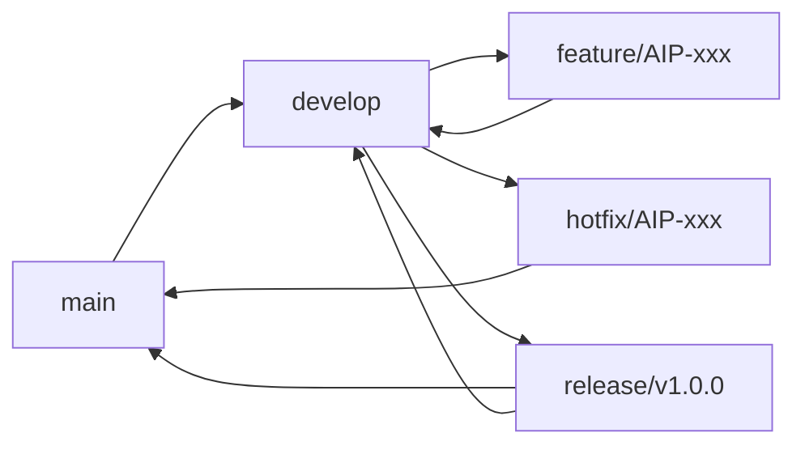

# 3단계: Bitbucket 리포지토리 설정

## 📋 개요
아두이노 프로젝트를 위한 Bitbucket 리포지토리를 설정하고 Git 워크플로우를 구성합니다.

## 🚀 리포지토리 생성

### 1. 새 리포지토리 만들기

1. **Bitbucket 접속** → **Repositories** → **Create repository**
2. **리포지토리 정보 입력**:
   ```
   Repository name: arduino-iot-project
   Workspace: your-workspace
   Project: Arduino Projects (새로 생성)
   Access level: Private
   Include a README: Yes
   Include .gitignore: Yes (선택: Arduino)
   Include a license: MIT License
   ```

### 2. 초기 설정

**Repository settings**:
```
Default branch: main
Language: C++
Description: Arduino IoT project with CI/CD pipeline
Website: (프로젝트 문서 URL)
```

## 🌿 브랜치 전략 설정

### Git Flow 브랜치 모델



### 브랜치 유형

1. **main**: 프로덕션 코드 (항상 안정적)
2. **develop**: 개발 통합 브랜치
3. **feature/**: 새 기능 개발
4. **hotfix/**: 긴급 버그 수정
5. **release/**: 릴리즈 준비

### 브랜치 네이밍 규칙

```bash
# 기능 브랜치
feature/AIP-123-temperature-sensor
feature/AIP-456-wifi-connection

# 버그 수정
bugfix/AIP-789-sensor-reading-error
hotfix/AIP-999-critical-memory-leak

# 릴리즈 브랜치
release/v1.0.0
release/v1.1.0

# 기타
docs/update-readme
chore/update-dependencies
```

## 🔒 브랜치 보호 설정

### main 브랜치 보호

1. **Repository settings** → **Branch permissions**
2. **Add restriction** for `main` branch:

```yaml
Branch: main
Restrictions:
  - Prevent force pushes: ✅
  - Prevent deletion: ✅
  - Restrict pushes: ✅
  - Restrict merges: ✅
  
Access:
  - Users: Project Lead only
  - Groups: Developers (merge only)
  
Merge requirements:
  - Pull request required: ✅
  - Minimum approvals: 2
  - Reset approvals on change: ✅
  - Dismiss stale reviews: ✅
```

### develop 브랜치 보호

```yaml
Branch: develop
Restrictions:
  - Prevent force pushes: ✅
  - Prevent deletion: ✅
  
Merge requirements:
  - Pull request required: ✅
  - Minimum approvals: 1
  - All conversations resolved: ✅
```

## 🔧 Pull Request 템플릿

### PR 템플릿 생성

**.bitbucket/pull_request_template.md**:
```markdown
## 📋 Pull Request 정보

### Jira 이슈
- 관련 이슈: [AIP-XXX](https://your-company.atlassian.net/browse/AIP-XXX)

### 변경 사항
- [ ] 새 기능 추가
- [ ] 버그 수정
- [ ] 성능 개선
- [ ] 리팩토링
- [ ] 문서 업데이트
- [ ] 테스트 추가

### 설명
간단하고 명확한 변경 사항 설명

### 테스트
- [ ] 단위 테스트 통과
- [ ] 통합 테스트 통과
- [ ] 하드웨어 테스트 완료
- [ ] 새 테스트 케이스 추가

### 하드웨어 영향
- 사용된 보드: Arduino Uno / ESP32 / ESP8266
- 추가된 라이브러리: 
- 핀 사용 변경: 
- 메모리 사용량 변화: 

### 배포 고려사항
- [ ] 기존 설정과 호환됨
- [ ] 마이그레이션 필요없음
- [ ] 문서 업데이트 완료
- [ ] Breaking changes 없음

### 스크린샷/로그 (있다면)
<!-- 시리얼 출력, 오실로스코프 캡처, 회로 사진 등 -->

### 체크리스트
- [ ] 코드 스타일 가이드 준수
- [ ] 자체 코드 리뷰 완료
- [ ] 관련 문서 업데이트
- [ ] 기존 테스트 케이스 통과
- [ ] 새 기능에 대한 테스트 추가
```

## 🔗 웹훅 설정

### Jenkins 웹훅

1. **Repository settings** → **Webhooks** → **Add webhook**

**Jenkins 웹훅 설정**:
```json
{
  "title": "Jenkins CI/CD Trigger",
  "url": "http://your-jenkins-server:8080/bitbucket-hook/",
  "description": "Trigger Jenkins build on push and PR",
  "events": [
    "repo:push",
    "pullrequest:created",
    "pullrequest:updated",
    "pullrequest:merged",
    "pullrequest:declined"
  ],
  "active": true
}
```

### Jira 연동 웹훅

**Jira Smart Commits 설정**:
```json
{
  "title": "Jira Integration",
  "url": "https://your-company.atlassian.net/rest/bitbucket/1.0/repository",
  "description": "Update Jira issues from commits",
  "events": [
    "repo:push",
    "pullrequest:merged"
  ],
  "active": true
}
```

## 📝 커밋 메시지 규칙

### 커밋 메시지 형식

```
<type>(scope): <subject> [AIP-XXX]

<body>

<footer>
```

### 타입 정의

- **feat**: 새 기능
- **fix**: 버그 수정
- **docs**: 문서 변경
- **style**: 코드 포맷팅
- **refactor**: 코드 리팩토링
- **test**: 테스트 추가/수정
- **chore**: 빌드 프로세스 등 기타 변경

### 예시

```bash
# 기능 추가
feat(sensor): add DHT22 temperature reading [AIP-123]

Implement temperature and humidity reading functionality
using DHT22 sensor with error handling and calibration.

- Add DHT sensor library integration
- Implement sensor initialization
- Add temperature/humidity reading methods
- Include error handling for sensor failures

Closes AIP-123

# 버그 수정
fix(wifi): resolve connection timeout issue [AIP-456]

Fixed WiFi connection timeout by implementing retry logic
and increasing connection timeout to 10 seconds.

Fixes AIP-456

# Jira Smart Commits
feat(display): add OLED display support [AIP-789]

#time 4h
#comment Implemented OLED display driver with basic text rendering
```

## 🔍 코드 리뷰 가이드라인

### 리뷰 체크리스트

**기능성**:
- [ ] 코드가 요구사항을 충족하는가?
- [ ] 에지 케이스가 처리되었는가?
- [ ] 에러 핸들링이 적절한가?

**성능**:
- [ ] 메모리 사용량이 적절한가?
- [ ] CPU 사용률이 최적화되었는가?
- [ ] 전력 소비가 고려되었는가?

**안전성**:
- [ ] 하드웨어 보호 로직이 있는가?
- [ ] 입력 검증이 충분한가?
- [ ] 타임아웃이 설정되었는가?

**가독성**:
- [ ] 코드가 이해하기 쉬운가?
- [ ] 주석이 적절한가?
- [ ] 네이밍이 명확한가?

**테스트**:
- [ ] 단위 테스트가 충분한가?
- [ ] 실제 하드웨어 테스트가 완료되었는가?
- [ ] 테스트 커버리지가 적절한가?

### 리뷰 코멘트 가이드

**Good Practice**:
```
✅ Good: "전력 절약을 위해 delay() 대신 deep sleep을 고려해보세요."
✅ Good: "이 함수는 센서 오류시 무한 루프에 빠질 수 있습니다. 타임아웃을 추가하면 어떨까요?"
✅ Good: "const 키워드를 사용해서 메모리를 절약할 수 있습니다."
```

**Avoid**:
```
❌ Bad: "이 코드는 잘못되었습니다."
❌ Bad: "다시 작성하세요."
❌ Bad: "이해할 수 없습니다."
```

## 📁 리포지토리 구조 최적화

### .gitignore 설정

**.gitignore**:
```bash
# Arduino
*.hex
*.elf
*.map
*.o
*.a
*.d
build/
.pioenvs/
.piolibdeps/
.pio/

# IDE
.vscode/settings.json
.vscode/launch.json
.idea/
*.swp
*.swo
*~

# OS
.DS_Store
.DS_Store?
._*
.Spotlight-V100
.Trashes
ehthumbs.db
Thumbs.db

# Logs
*.log
logs/
*.tmp
*.temp

# Environment
.env
secrets/
config/local.json

# Dependencies
node_modules/
lib/
libraries/downloaded/

# Test artifacts
test_results/
coverage/
*.gcov
*.gcda
*.gcno

# Hardware specific
*.fzz.bak
*.sch.bak
*.brd.bak
```

### Repository badges

**README.md에 추가할 뱃지들**:
```markdown
[](http://your-jenkins-server/job/arduino-iot-project/)
[](https://opensource.org/licenses/MIT)
[](https://arduino.cc/)
[](https://bitbucket.org/your-workspace/arduino-iot-project/issues)
[](http://your-jenkins-server/job/arduino-iot-project/lastBuild/coverage/)
```

## 🔐 SSH 키 설정

### SSH 키 생성 및 등록

1. **SSH 키 생성**:
```bash
ssh-keygen -t rsa -b 4096 -C "your-email@company.com"
ssh-add ~/.ssh/id_rsa
```

2. **Bitbucket에 SSH 키 등록**:
   - **Personal settings** → **SSH keys** → **Add key**
   - 공개키 내용 붙여넣기

3. **연결 테스트**:
```bash
ssh -T git@bitbucket.org
```

### Repository clone

```bash
# SSH 사용 (권장)
git clone git@bitbucket.org:your-workspace/arduino-iot-project.git

# HTTPS 사용
git clone https://your-username@bitbucket.org/your-workspace/arduino-iot-project.git
```

## 🎛️ 고급 설정

### LFS (Large File Storage) 설정

아두이노 프로젝트의 큰 파일들 (회로도, 바이너리, 이미지) 관리:

1. **Git LFS 초기화**:
```bash
git lfs install
```

2. **.gitattributes 설정**:
```bash
# 이미지 파일
*.png filter=lfs diff=lfs merge=lfs -text
*.jpg filter=lfs diff=lfs merge=lfs -text
*.gif filter=lfs diff=lfs merge=lfs -text

# 회로도 파일
*.fzz filter=lfs diff=lfs merge=lfs -text
*.sch filter=lfs diff=lfs merge=lfs -text
*.brd filter=lfs diff=lfs merge=lfs -text

# 바이너리 파일
*.bin filter=lfs diff=lfs merge=lfs -text
*.hex filter=lfs diff=lfs merge=lfs -text
*.elf filter=lfs diff=lfs merge=lfs -text

# 문서 파일
*.pdf filter=lfs diff=lfs merge=lfs -text
*.docx filter=lfs diff=lfs merge=lfs -text
```

### 자동 태깅 설정

**release.sh 스크립트**:
```bash
#!/bin/bash
# 자동 릴리즈 태깅 스크립트

VERSION=$1
if [ -z "$VERSION" ]; then
    echo "Usage: ./release.sh <version>"
    echo "Example: ./release.sh v1.0.0"
    exit 1
fi

# 버전 검증
if [[ ! $VERSION =~ ^v[0-9]+\.[0-9]+\.[0-9]+$ ]]; then
    echo "Error: Version must follow semantic versioning (vX.Y.Z)"
    exit 1
fi

# 현재 브랜치 확인
CURRENT_BRANCH=$(git branch --show-current)
if [ "$CURRENT_BRANCH" != "main" ]; then
    echo "Error: Must be on main branch to create release"
    exit 1
fi

# 변경사항 확인
if [ -n "$(git status --porcelain)" ]; then
    echo "Error: Working directory is not clean"
    exit 1
fi

# 태그 생성
git tag -a $VERSION -m "Release $VERSION"
git push origin $VERSION

echo "Release $VERSION created successfully!"
```

### Code Quality 설정

**pre-commit hooks 설정**:

**.git/hooks/pre-commit**:
```bash
#!/bin/bash
# Pre-commit hook for Arduino projects

echo "Running pre-commit checks..."

# Arduino CLI syntax check
if command -v arduino-cli &> /dev/null; then
    echo "Checking Arduino syntax..."
    if ! arduino-cli compile --fqbn arduino:avr:uno src/main --verify; then
        echo "❌ Arduino compilation failed"
        exit 1
    fi
    echo "✅ Arduino compilation passed"
fi

# Check for TODO/FIXME in commit
if git diff --cached | grep -E "(TODO|FIXME|XXX)" > /dev/null; then
    echo "❌ Commit contains TODO/FIXME. Please resolve before committing."
    exit 1
fi

# Check commit message format
COMMIT_REGEX='^(feat|fix|docs|style|refactor|test|chore)(\(.+\))?: .+ \[AIP-[0-9]+\]$'
COMMIT_MSG=$(git log --format=%B -n 1 HEAD)

if [[ ! $COMMIT_MSG =~ $COMMIT_REGEX ]]; then
    echo "❌ Invalid commit message format"
    echo "Expected: type(scope): description [AIP-XXX]"
    exit 1
fi

echo "✅ All pre-commit checks passed"
```

## ✅ 검증 단계

### 1. 리포지토리 설정 확인
- [ ] 리포지토리 생성 완료
- [ ] 브랜치 보호 설정 완료
- [ ] PR 템플릿 생성 완료
- [ ] .gitignore 설정 완료

### 2. 웹훅 설정 확인
- [ ] Jenkins 웹훅 설정 완료
- [ ] Jira 연동 설정 완료
- [ ] 웹훅 테스트 성공

### 3. 워크플로우 테스트
- [ ] 브랜치 생성/삭제 테스트
- [ ] PR 생성/머지 테스트
- [ ] 커밋 메시지 규칙 테스트
- [ ] 코드 리뷰 프로세스 확인

### 4. 보안 설정 확인
- [ ] SSH 키 등록 완료
- [ ] 접근 권한 설정 완료
- [ ] 민감 정보 제외 확인

## 🎯 다음 단계

Bitbucket 리포지토리 설정이 완료되었습니다. 다음 단계로 진행하세요:

➡️ **[4단계: Jenkins CI/CD 파이프라인](04-jenkins-pipeline.md)**

## 📚 참고 자료

- [Bitbucket Git 튜토리얼](https://www.atlassian.com/git/tutorials)
- [브랜치 전략 가이드](https://www.atlassian.com/git/tutorials/comparing-workflows)
- [Smart Commits 문서](https://support.atlassian.com/bitbucket-cloud/docs/use-smart-commits/)