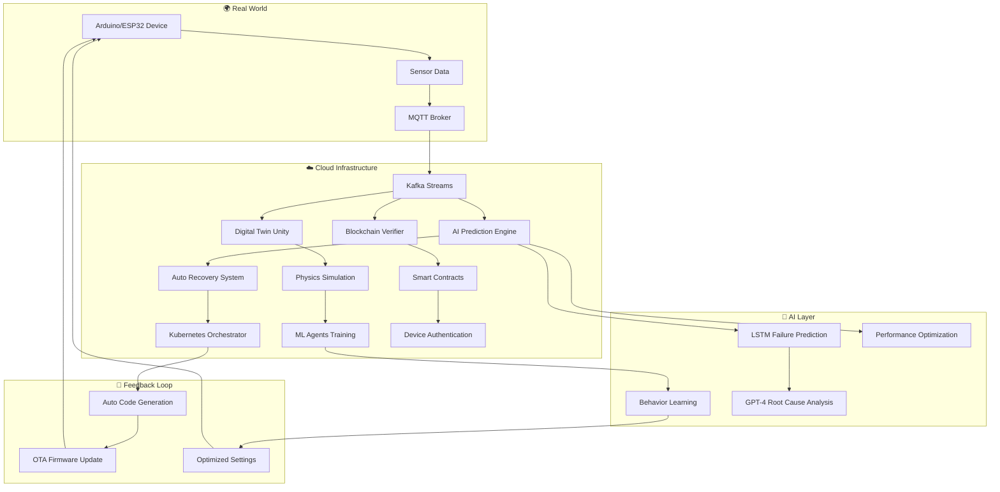

# 🌟 차세대 AI-Driven Arduino DevOps 생태계

> **"2025년, 인공지능이 직접 코드를 작성하고 하드웨어를 최적화하는 자율 DevOps 시스템"**

## 🚀 혁신적 업그레이드 개요

기존 Jira + Bitbucket + Jenkins 시스템을 **차세대 AI 중심 생태계**로 발전:

### 🧠 **AI-First Architecture**
- **GPT-4o 코드 생성**: 자연어로 Arduino 코드 자동 생성
- **ML 기반 예측 모니터링**: 장애 예측 및 자동 복구
- **지능형 테스트 생성**: AI가 자동으로 테스트 케이스 생성
- **자율 최적화**: 성능 데이터 학습 후 자동 코드 개선

### 🌐 **Microservices IoT Ecosystem**
- **Kubernetes 기반 오케스트레이션**: 확장 가능한 마이크로서비스
- **Service Mesh**: Istio로 트래픽 관리 및 보안
- **Event-Driven Architecture**: Apache Kafka로 실시간 데이터 스트리밍
- **GraphQL API Gateway**: 통합 데이터 인터페이스

### 🔮 **Digital Twin Simulation**
- **Unity 3D 가상 환경**: 실제 하드웨어의 디지털 트윈
- **물리 엔진 시뮬레이션**: 온도, 습도, 공기 흐름 등 물리적 시뮬레이션
- **AR/VR 모니터링**: HoloLens/Quest로 3D 시각화
- **What-if 시나리오**: 가상 환경에서 실험 후 실제 적용

### 🛡️ **Blockchain-Secured DevOps**
- **스마트 컨트랙트 기반 배포**: 불변의 배포 기록
- **분산 코드 검증**: 블록체인으로 코드 무결성 보장
- **NFT 기반 디바이스 인증**: 각 IoT 디바이스의 고유 신원
- **탈중앙화 모니터링**: 분산 네트워크로 감시

---

## 🎯 **구현된 차세대 시스템 구성요소**

### 🧠 **AI-Powered Code Generator** (`ai-code-generator.py`)
- **GPT-4o 기반 자연어 → Arduino 코드 변환**
- **자동 테스트 케이스 생성**
- **성능 분석 및 최적화**
- **실시간 코드 품질 평가**

### 🌐 **Kubernetes IoT Orchestrator** (`kubernetes-iot-orchestrator.yaml`)
- **마이크로서비스 기반 확장 가능한 인프라**
- **Apache Kafka 실시간 데이터 스트리밍**
- **Istio Service Mesh 보안 및 트래픽 관리**
- **HPA(Horizontal Pod Autoscaler) 자동 스케일링**

### 🛡️ **Blockchain Security System** (`blockchain-smart-contracts.sol`)
- **NFT 기반 IoT 디바이스 인증**
- **스마트 컨트랙트 코드 검증 시스템**
- **개발자 평판 토큰 이코노미**
- **불변의 배포 기록 관리**

### 🧠 **ML Predictive Monitoring** (`ml-predictive-monitoring.py`)
- **LSTM 기반 장애 예측 모델**
- **Isolation Forest 이상 탐지**
- **자동 성능 최적화 권고**
- **실시간 센서 데이터 분석**

### 🤖 **Autonomous Recovery System** (`autonomous-recovery-system.py`)
- **GPT-4 기반 근본 원인 분석**
- **자동 복구 액션 실행**
- **의존성 기반 위험 평가**
- **학습형 복구 패턴 개발**

### 🔮 **Digital Twin Unity Simulation** (`digital-twin-unity-simulation.cs`)
- **Unity ML-Agents 기반 AI 학습**
- **실시간 물리 엔진 시뮬레이션**
- **웹소켓 기반 실제 하드웨어 연동**
- **예측 모델링 및 What-if 시나리오**

---

## 🚀 **시스템 통합 아키텍처**



---

## 🧬 **Digital Twin Unity 시뮬레이션 엔진**

```csharp
using UnityEngine;
using System.Collections;
using Unity.MLAgents;

public class ArduinoDigitalTwin : MonoBehaviour
{
    [Header("Hardware Simulation")]
    public GameObject esp32Model;
    public ParticleSystem temperatureVisualization;
    public LineRenderer sensorDataGraph;
    
    [Header("AI Integration")]
    public MLAgentsEnvironment aiEnvironment;
    
    private float[] sensorHistory = new float[1000];
    private int historyIndex = 0;
    
    void Start()
    {
        // 실제 하드웨어와 WebSocket 연결
        StartCoroutine(ConnectToRealHardware());
        
        // AI 모델 초기화
        InitializeAIModels();
    }
    
    IEnumerator ConnectToRealHardware()
    {
        WebSocketConnection ws = new WebSocketConnection("ws://esp32-device:8080");
        
        while (true)
        {
            // 실제 센서 데이터 수신
            var sensorData = yield return ws.ReceiveData();
            
            // Digital Twin 업데이트
            UpdateVirtualEnvironment(sensorData);
            
            // AI 예측 실행
            var predictions = RunAIPredictions(sensorData);
            
            // 결과를 실제 하드웨어로 전송
            yield return ws.SendCommands(predictions.optimizedSettings);
            
            yield return new WaitForSeconds(0.1f); // 10Hz 업데이트
        }
    }
    
    void UpdateVirtualEnvironment(SensorData data)
    {
        // 온도 시각화
        var emission = temperatureVisualization.emission;
        emission.rateOverTime = data.temperature * 2;
        
        // 센서 데이터 그래프
        sensorHistory[historyIndex] = data.temperature;
        historyIndex = (historyIndex + 1) % sensorHistory.Length;
        UpdateGraph();
        
        // 물리 시뮬레이션 (바람, 습도 등)
        UpdatePhysicsSimulation(data);
    }
    
    PredictionResult RunAIPredictions(SensorData data)
    {
        // Unity ML-Agents로 AI 모델 실행
        var observation = new float[] {
            data.temperature,
            data.humidity,
            data.soilMoisture,
            data.lightLevel,
            Time.time
        };
        
        var action = aiEnvironment.GetAction(observation);
        
        return new PredictionResult
        {
            optimizedSettings = new DeviceSettings
            {
                fanSpeed = action[0],
                waterPumpDuration = action[1],
                ledBrightness = action[2],
                heaterPower = action[3]
            },
            confidence = action[4],
            predictedEfficiency = action[5]
        };
    }
}