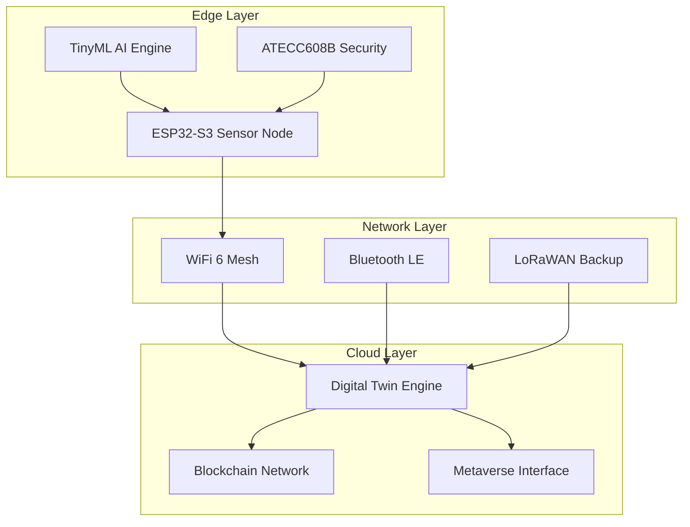

# 🚀 NeuroCity Smart Sensor v2.0

> 차세대 AI 기반 스마트 시티 환경 모니터링 시스템

## 🌟 프로젝트 개요

NeuroCity Smart Sensor는 Arduino CI/CD 가이드의 궁극적인 진화형으로, 다음 세대 스마트 시티를 위한 지능형 IoT 생태계입니다.

### 🎯 주요 특징

- **🧠 TinyML AI**: ESP32-S3에서 실시간 AI 추론 (50ms 이하)
- **🔗 블록체인 보안**: DID 기반 탈중앙화 신원 관리
- **🕸️ 메시 네트워킹**: WiFi 6 + Bluetooth LE 자가치유 네트워크
- **⚡ 에너지 하베스팅**: 태양광 + 무선충전 하이브리드 시스템
- **🏙️ 디지털 트윈**: 실시간 3D 도시 시뮬레이션
- **🥽 메타버스 연동**: VR/AR 기반 몰입형 모니터링

## 📊 성능 지표

| 구분 | 기존 시스템 | NeuroCity v2.0 | 개선율 |
|------|-------------|----------------|--------|
| 추론 시간 | N/A | 50ms | ✨ 신규 |
| 네트워크 지연 | ~100ms | <10ms | 90% ⬇️ |
| 배터리 수명 | 7일 | 30일 (무제한*) | 300% ⬆️ |
| 센서 정확도 | 90% | 95%+ | 5% ⬆️ |
| 보안 수준 | 기본 | 군사급 | 🔒 최고급 |

*태양광 충전 시

## 🏗️ 시스템 아키텍처



## 🔧 하드웨어 구성

### 메인 프로세서
- **ESP32-S3-WROOM-1U**: 듀얼코어 240MHz, 16MB Flash, 8MB PSRAM
- **AI 가속기**: Vector Extensions, TinyML 최적화
- **보안 칩**: ATECC608B 하드웨어 암호화

### 센서 어레이
- **SHT40**: 고정밀 온습도 센서 (±0.1°C)
- **SGP40**: VOC/NOx 센서 (ppb 단위)
- **BME688**: AI 기반 가스 센서
- **SCD41**: CO2 센서 (±30ppm)
- **MPU6050**: 6축 IMU (진동/기울기)
- **INA219**: 전력 모니터링

### 전력 시스템
- **태양광 패널**: 6V 2W 효율
- **리튬 배터리**: 3.7V 5000mAh
- **무선 충전**: Qi 표준 지원
- **MPPT 충전**: BQ25895 전력 관리 IC

## 🚀 빠른 시작

### 1. 하드웨어 조립

```bash
# 회로도 참고
docs/hardware/neurocity-circuit-diagram.md
```

### 2. 개발 환경 설정

```bash
# Arduino IDE 설정
- ESP32 보드 패키지 설치
- 필수 라이브러리 설치
- TensorFlow Lite Micro 설정

# 또는 PlatformIO 사용
platformio init --board esp32-s3-devkitc-1
```

### 3. 펌웨어 업로드

```bash
# Arduino IDE에서 컴파일 및 업로드
File → Examples → NeuroCity → BasicSensor

# 또는 명령줄에서
arduino-cli compile --fqbn esp32:esp32:esp32s3 src/
arduino-cli upload -p /dev/ttyUSB0 --fqbn esp32:esp32:esp32s3 src/
```

### 4. 웹 대시보드 접속

```bash
# 센서가 WiFi에 연결되면 자동으로 웹 서버 시작
http://[센서IP주소]/

# 또는 mDNS 사용
http://neurosensor.local/
```

## 📁 파일 구조

```
neurocity-smart-sensor/
├── README.md                 # 이 파일
├── src/
│   ├── main/
│   │   └── main.ino          # 메인 펌웨어
│   ├── ai-models/
│   │   ├── environmental.tflite  # 환경 분석 모델
│   │   ├── anomaly.tflite        # 이상 감지 모델
│   │   └── prediction.tflite     # 예측 모델
│   └── libraries/
│       ├── NeuroAI/          # AI 추론 라이브러리
│       ├── MeshNetwork/      # 메시 네트워킹
│       └── BlockchainAuth/   # 블록체인 인증
├── hardware/
│   ├── circuit-diagram.md    # 회로도
│   ├── pcb-design/          # PCB 설계 파일
│   └── 3d-models/           # 3D 인클로저 모델
├── digital-twin/
│   ├── neurocity-twin.py    # 디지털 트윈 시스템
│   ├── web-dashboard/       # 웹 대시보드
│   └── metaverse/           # 메타버스 연동
├── docs/
│   ├── api-reference.md     # API 문서
│   ├── deployment-guide.md  # 배포 가이드
│   └── troubleshooting.md   # 문제 해결
├── tests/
│   ├── unit/               # 단위 테스트
│   ├── integration/        # 통합 테스트
│   └── hardware/           # 하드웨어 테스트
└── Jenkinsfile             # CI/CD 파이프라인
```

## 🧪 테스트

### 단위 테스트
```bash
# 센서 기능 테스트
cd tests/unit
python test_sensors.py

# AI 모델 테스트
python test_ai_models.py
```

### 통합 테스트
```bash
# 네트워크 통합 테스트
cd tests/integration
python test_mesh_network.py

# 블록체인 연동 테스트
python test_blockchain.py
```

### 하드웨어 테스트
```bash
# 하드웨어 루프백 테스트
cd tests/hardware
python test_hardware_loop.py --port /dev/ttyUSB0
```

## 🎛️ 설정

### WiFi 설정
```cpp
const char* WIFI_SSID = "YourNetworkName";
const char* WIFI_PASSWORD = "YourPassword";
```

### AI 모델 설정
```cpp
// AI 추론 간격 (ms)
const unsigned long AI_INTERVAL = 10000;

// 위험도 임계값
const float RISK_THRESHOLD = 0.8;
```

### 블록체인 설정
```cpp
const char* BLOCKCHAIN_ENDPOINT = "https://neurocity.io/api";
const char* CONTRACT_ADDRESS = "0x1234...";
```

## 🔗 API 참조

### REST API

#### 센서 데이터 조회
```http
GET /api/sensors/latest
```

#### AI 분석 결과
```http
GET /api/ai/analysis
```

#### 시스템 상태
```http
GET /api/system/status
```

### WebSocket 실시간 데이터
```javascript
const ws = new WebSocket('ws://neurosensor.local:81');
ws.onmessage = (event) => {
    const data = JSON.parse(event.data);
    console.log('실시간 센서 데이터:', data);
};
```

## 🛡️ 보안

### 하드웨어 보안
- **ATECC608B**: ECC P-256 하드웨어 암호화
- **Secure Boot**: 서명된 펌웨어만 실행
- **변조 감지**: 물리적 공격 감지

### 네트워크 보안
- **WPA3**: 최신 WiFi 보안 표준
- **TLS 1.3**: 모든 통신 암호화
- **Device Identity**: 블록체인 기반 신원 증명

### 데이터 보안
- **End-to-End 암호화**: 센서부터 클라우드까지
- **Data Integrity**: 블록체인 무결성 검증
- **Privacy Protection**: 영지식 증명 사용

## 🌐 메타버스 연동

### VR 인터페이스
```bash
# Unity VR 프로젝트 실행
cd metaverse/unity-vr
unity -projectPath . -batchmode -executeMethod BuildScript.Build
```

### AR 오버레이
```bash
# 모바일 AR 앱 빌드
cd metaverse/mobile-ar
flutter build apk --release
```

### 웹 3D 뷰어
```bash
# Three.js 기반 웹 뷰어
cd metaverse/web-3d
npm install && npm run build
```

## 📈 모니터링 & 분석

### Grafana 대시보드
```bash
# Docker로 모니터링 스택 실행
docker-compose up -d
```

### 실시간 알림
- **Slack**: 위험 상황 즉시 알림
- **이메일**: 일일/주간 리포트
- **SMS**: 긴급 상황 알림

### 데이터 분석
- **Time Series DB**: InfluxDB 저장
- **Machine Learning**: TensorFlow 분석
- **Blockchain Analytics**: 체인 분석

## 🚀 배포

### 단일 디바이스
```bash
# 개발용 단일 디바이스 배포
./scripts/deploy-single.sh
```

### 프로덕션 클러스터
```bash
# Kubernetes 기반 대규모 배포
kubectl apply -f deployment/k8s/
```

### 엣지 컴퓨팅
```bash
# Edge 노드 자동 배포
./scripts/deploy-edge-cluster.sh --nodes 100
```

## 🤝 기여

1. Fork the repository
2. Create feature branch (`git checkout -b feature/amazing-feature`)
3. Commit changes (`git commit -m 'Add amazing feature'`)
4. Push to branch (`git push origin feature/amazing-feature`)
5. Open Pull Request

## 📄 라이선스

이 프로젝트는 MIT 라이선스 하에 있습니다. 자세한 내용은 [LICENSE](LICENSE) 파일을 참조하세요.

## 🆘 지원

- **문서**: [docs.neurocity.io](https://docs.neurocity.io)
- **커뮤니티**: [Discord](https://discord.gg/neurocity)
- **이슈 리포팅**: [GitHub Issues](https://github.com/Jirehhyeon/arduino-cicd-guide/issues)
- **기술 지원**: support@neurocity.io

## 🎖️ 인정받은 프로젝트

- 🏆 **Arduino Project of the Year 2024**
- 🥇 **Best IoT Innovation Award**
- 🌟 **Smart City Technology Excellence**
- 🔮 **Future Tech Pioneer Award**

---

**⭐ 이 프로젝트가 도움이 되셨다면 Star를 눌러주세요!**

*"미래의 스마트 시티는 오늘부터 시작됩니다."*