# 🎓 Arduino IoT DevOps 전문가 양성 프로그램

> **차세대 IoT 개발자를 위한 완전 통합 교육 시스템**  
> *From Zero to Enterprise DevOps Hero in 12 Weeks*

## 🌟 프로그램 개요

**Industry 4.0 시대의 IoT DevOps 전문가**가 되기 위한 체계적이고 실무 중심적인 교육 프로그램입니다. 실제 기업 환경에서 사용되는 최신 기술스택과 베스트 프랙티스를 학습하여 **글로벌 경쟁력을 갖춘 IoT 개발자**로 성장할 수 있습니다.

### 🎯 학습 목표

**기술적 역량**
- ✅ 엔터프라이즈급 IoT 시스템 설계 및 구현
- ✅ 차세대 DevOps 파이프라인 구축 및 운영
- ✅ AI/ML 기반 자동화 시스템 개발
- ✅ 클라우드 네이티브 아키텍처 설계

**비즈니스 역량**
- ✅ 프로젝트 관리 및 팀 리더십
- ✅ 기술 아키텍처 의사결정
- ✅ ROI 기반 기술 도입 전략
- ✅ 글로벌 협업 및 커뮤니케이션

## 📊 학습 성과 지표

| 지표 | 목표 | 측정 방법 |
|------|------|-----------|
| **기술 숙련도** | 95%+ | 실습 프로젝트 평가 |
| **실무 적용도** | 90%+ | 포트폴리오 품질 평가 |
| **문제 해결 능력** | 85%+ | 트러블슈팅 시뮬레이션 |
| **협업 능력** | 90%+ | 팀 프로젝트 평가 |
| **학습 만족도** | 95%+ | 피드백 설문조사 |

## 🗺️ 학습 로드맵

### 📈 학습 진행도 시각화

```mermaid
gantt
    title Arduino IoT DevOps 전문가 양성 프로그램
    dateFormat X
    axisFormat %s
    
    section Foundation
    기초 환경 구축     :a1, 0, 1w
    Git & VSCode      :a2, after a1, 1w
    
    section Development
    Arduino 개발      :b1, after a2, 2w
    원격 개발 환경    :b2, after b1, 1w
    
    section DevOps
    CI/CD 파이프라인  :c1, after b2, 2w
    Jenkins 고도화    :c2, after c1, 1w
    
    section Management
    Jira 자동화      :d1, after c2, 2w
    AI 통합          :d2, after d1, 1w
    
    section Advanced
    최종 프로젝트     :e1, after d2, 2w
    인증 및 포트폴리오 :e2, after e1, 1w
```

### 🏗️ 4단계 학습 체계

#### **Level 1: Foundation Builder** (주차 1-3)
- 🎯 **목표**: 기본 도구 숙련 및 개념 이해
- 📚 **핵심 스킬**: Git, VSCode, Arduino 기초, Linux 명령어
- 🏆 **성취 지표**: 기본 Arduino 프로젝트 5개 완성

#### **Level 2: Development Expert** (주차 4-6)  
- 🎯 **목표**: 전문적인 개발 환경 구축
- 📚 **핵심 스킬**: 원격 개발, 코드 품질, 테스팅, 디버깅
- 🏆 **성취 지표**: 실무급 IoT 애플리케이션 완성

#### **Level 3: DevOps Engineer** (주차 7-9)
- 🎯 **목표**: 자동화 파이프라인 구축 및 운영
- 📚 **핵심 스킬**: Jenkins, Docker, CI/CD, 모니터링
- 🏆 **성취 지표**: 완전 자동화된 배포 시스템 구축

#### **Level 4: Enterprise Architect** (주차 10-12)
- 🎯 **목표**: AI 기반 지능형 시스템 설계
- 📚 **핵심 스킬**: AI/ML 통합, 아키텍처 설계, 팀 리더십
- 🏆 **성취 지표**: 엔터프라이즈급 포트폴리오 완성

## 📚 상세 커리큘럼

### 🗓️ Week-by-Week 학습 계획

<strong>Week 1-2: 개발 환경 마스터리</strong>

**Week 1: Foundation Setup**
- **Day 1-2**: 개발 환경 구축
  - Windows + Linux 듀얼 환경 설정
  - VSCode + Remote Development 설정
  - Git 기초 및 워크플로우
  
- **Day 3-4**: Arduino 기초 마스터
  - Arduino IDE vs CLI 비교
  - 기본 센서 및 액추에이터 제어
  - 시리얼 통신 및 디버깅

- **Day 5-7**: 실습 프로젝트
  - LED 제어 시스템
  - 온도 센서 모니터링
  - WiFi 연결 및 데이터 전송

**Week 2: Advanced Development**
- **Day 1-2**: 고급 Arduino 기법
  - 인터럽트 및 타이머 활용
  - 메모리 최적화 기법
  - 전력 관리 및 절약 모드

- **Day 3-4**: 코드 품질 관리
  - 코드 스타일 및 컨벤션
  - 단위 테스트 작성
  - 정적 분석 도구 활용

- **Day 5-7**: 통합 실습
  - 스마트 홈 IoT 시스템 구축
  - 실시간 데이터 수집 및 분석
  - 웹 대시보드 연동

<strong>Week 3-4: 원격 개발 및 협업</strong>

**Week 3: Remote Development Mastery**
- **Day 1-2**: SSH 및 보안 설정
  - Ed25519 키 생성 및 관리
  - SSH 설정 최적화
  - 보안 베스트 프랙티스

- **Day 3-4**: VSCode Remote 고급 활용
  - 포트 포워딩 및 터널링
  - 원격 디버깅 및 프로파일링
  - 확장 프로그램 최적화

- **Day 5-7**: 팀 협업 실습
  - 페어 프로그래밍 세션
  - 원격 코드 리뷰
  - 실시간 협업 도구 활용

**Week 4: Git Advanced Workflows**
- **Day 1-2**: Git Flow 마스터
  - 브랜치 전략 및 네이밍
  - Merge vs Rebase 전략
  - 충돌 해결 및 관리

- **Day 3-4**: 코드 리뷰 프로세스
  - Pull Request 템플릿 작성
  - 코드 리뷰 가이드라인
  - 자동화된 품질 검사

- **Day 5-7**: 실무 시뮬레이션
  - 멀티 개발자 협업 시나리오
  - 릴리즈 브랜치 관리
  - 핫픽스 및 응급 배포

<strong>Week 5-6: 품질 보증 및 테스팅</strong>

**Week 5: Testing Excellence**
- **Day 1-2**: 테스트 전략 수립
  - 단위 테스트 vs 통합 테스트
  - 하드웨어 모킹 및 시뮬레이션
  - 테스트 커버리지 관리

- **Day 3-4**: 자동화 테스트 구축
  - Arduino 단위 테스트 프레임워크
  - CI/CD 통합 테스트
  - 성능 및 스트레스 테스트

- **Day 5-7**: 품질 메트릭
  - 코드 복잡도 분석
  - 정적 분석 및 린팅
  - 품질 대시보드 구축

**Week 6: Security & Performance**
- **Day 1-2**: 보안 테스팅
  - 취약점 스캔 및 분석
  - 펌웨어 보안 검증
  - 암호화 및 인증 구현

- **Day 3-4**: 성능 최적화
  - 메모리 프로파일링
  - 실행 시간 최적화
  - 전력 소비 분석

- **Day 5-7**: 실전 프로젝트
  - 보안 강화 IoT 시스템
  - 성능 모니터링 대시보드
  - 취약점 대응 시뮬레이션

<strong>Week 7-8: CI/CD 파이프라인 구축</strong>

**Week 7: Jenkins Foundation**
- **Day 1-2**: Jenkins 설치 및 설정
  - Docker 기반 Jenkins 구축
  - 플러그인 관리 및 보안 설정
  - 백업 및 복구 전략

- **Day 3-4**: 첫 번째 파이프라인
  - Jenkinsfile 작성법
  - 기본 빌드 파이프라인 구축
  - Arduino 컴파일 자동화

- **Day 5-7**: 고급 파이프라인
  - 멀티 브랜치 파이프라인
  - 병렬 실행 및 최적화
  - 파이프라인 디버깅

**Week 8: Advanced CI/CD**
- **Day 1-2**: Docker 통합
  - 컨테이너 기반 빌드 환경
  - 이미지 최적화 및 캐싱
  - 레지스트리 연동

- **Day 3-4**: 자동 배포 시스템
  - 무중단 배포 전략
  - 롤백 메커니즘 구현
  - 환경별 배포 관리

- **Day 5-7**: 모니터링 통합
  - Prometheus 메트릭 수집
  - Grafana 대시보드 구축
  - 알림 및 장애 대응

<strong>Week 9-10: AI 기반 자동화</strong>

**Week 9: Jira Automation**
- **Day 1-2**: Jira 고급 설정
  - 워크플로우 설계
  - 커스텀 필드 및 스크린
  - 권한 관리 및 보안

- **Day 3-4**: 자동화 룰 구축
  - 트리거 및 조건 설정
  - 액션 및 후처리 함수
  - 복잡한 비즈니스 로직 구현

- **Day 5-7**: 외부 시스템 연동
  - REST API 통합
  - 웹훅 및 이벤트 처리
  - 타사 도구 연동

**Week 10: AI Integration**
- **Day 1-2**: AI 기초 및 준비
  - OpenAI API 설정
  - 머신러닝 기초 개념
  - 데이터 전처리 및 준비

- **Day 3-4**: 이슈 분류 AI 구축
  - GPT-4 기반 텍스트 분석
  - 우선순위 예측 모델
  - 자동 태깅 시스템

- **Day 5-7**: 예측 분석 시스템
  - 프로젝트 메트릭 예측
  - 리소스 사용량 분석
  - 자동 리포트 생성

<strong>Week 11-12: 마스터 프로젝트</strong>

**Week 11: Capstone Project**
- **Day 1-2**: 프로젝트 기획
  - 요구사항 분석 및 설계
  - 아키텍처 문서 작성
  - 개발 일정 수립

- **Day 3-4**: 핵심 기능 개발
  - 백엔드 시스템 구축
  - 프론트엔드 인터페이스
  - 하드웨어 연동 구현

- **Day 5-7**: 통합 및 테스트
  - 시스템 통합 테스트
  - 성능 및 부하 테스트
  - 사용자 승인 테스트

**Week 12: Portfolio & Certification**
- **Day 1-2**: 문서화 및 정리
  - 기술 문서 작성
  - API 문서 생성
  - 배포 가이드 작성

- **Day 3-4**: 발표 준비
  - 프레젠테이션 작성
  - 데모 시나리오 준비
  - Q&A 시뮬레이션

- **Day 5-7**: 최종 평가
  - 포트폴리오 발표
  - 기술 면접 시뮬레이션
  - 인증서 발급

## 🛠️ 학습 도구 및 리소스

### 💻 필수 도구
- **개발 환경**: VSCode + Remote Development
- **버전 관리**: Git + Bitbucket
- **CI/CD**: Jenkins + Docker
- **모니터링**: Prometheus + Grafana
- **프로젝트 관리**: Jira + Confluence

### 📚 학습 자료
- **공식 문서**: Arduino, Jenkins, Docker, Kubernetes
- **온라인 코스**: Coursera, Udemy, Pluralsight 연계
- **실습 랩**: AWS EC2, Google Cloud Platform 크레딧
- **커뮤니티**: Discord 채널, 주간 멘토링 세션

### 🏆 인증 프로그램
- **Level 1**: Arduino IoT Developer
- **Level 2**: DevOps Associate  
- **Level 3**: CI/CD Engineer
- **Level 4**: Enterprise Architect

## 🎯 평가 및 피드백

### 📊 평가 방식
- **실습 과제** (40%): 주간 실습 프로젝트
- **중간 평가** (20%): 6주차 종합 평가
- **팀 프로젝트** (20%): 협업 능력 평가
- **최종 포트폴리오** (20%): 개인 역량 종합 평가

### 🔄 지속적 개선
- **주간 회고**: 학습 진도 점검 및 조정
- **멘토링**: 1:1 개인 코칭 세션
- **피어 리뷰**: 동료 학습자 간 상호 피드백
- **산업 전문가**: 월 1회 게스트 강연

## 🚀 다음 단계

프로그램 완료 후 경력 발전 경로:

1. **Junior IoT Developer** → **Senior IoT Engineer** (2-3년)
2. **DevOps Engineer** → **Platform Engineer** (3-5년)  
3. **Technical Lead** → **Engineering Manager** (5-7년)
4. **Solution Architect** → **CTO** (7-10년)

---

**🎓 지금 시작하세요!** 차세대 IoT DevOps 전문가가 되는 여정을 함께 시작합시다.

[**📝 학습 신청하기**](learning/enrollment.md) | [**📞 1:1 상담 예약**](learning/consultation.md) | [**💬 커뮤니티 참여**](https://discord.gg/arduino-devops)