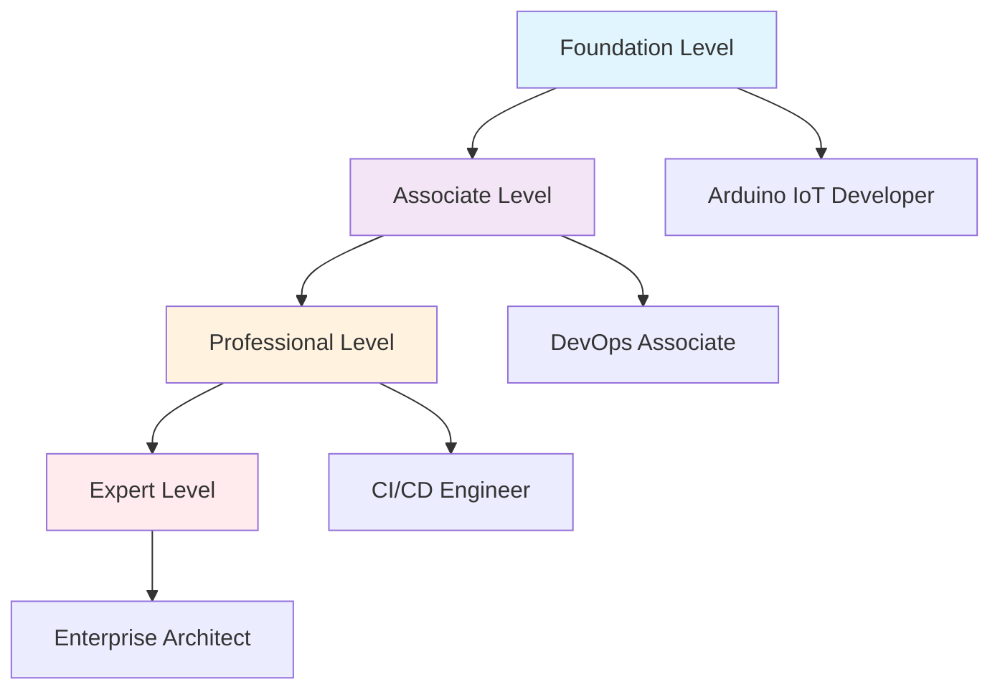

# 🏆 Arduino IoT DevOps 전문가 인증 프로그램

> **Industry 4.0 시대의 IoT 개발 역량을 검증하는 글로벌 표준 인증**

[](https://github.com/Jirehhyeon/arduino-cicd-guide/tree/main/learning/certification)
[](https://github.com/Jirehhyeon/arduino-cicd-guide/tree/main/learning/certification)
[](https://github.com/Jirehhyeon/arduino-cicd-guide/tree/main/learning/certification)

## 🌟 인증 프로그램 개요

**Arduino IoT DevOps Professional Certification**은 현대적인 IoT 개발 환경에서 요구되는 통합적 역량을 체계적으로 평가하고 인증하는 전문가 수준의 자격증입니다.

### 🎯 인증 목표
- ✅ **기술적 전문성**: Arduino/IoT 하드웨어부터 클라우드 배포까지 Full-Stack 역량
- ✅ **DevOps 숙련도**: 현대적 CI/CD 파이프라인 구축 및 운영 능력
- ✅ **문제 해결 능력**: 실무 환경에서 발생하는 복합적 문제의 체계적 해결
- ✅ **혁신적 사고**: AI/ML 기술을 활용한 차세대 IoT 시스템 설계

### 🏅 인증 레벨 체계



## 📋 인증 레벨별 상세 정보

### 🥉 Level 1: Arduino IoT Developer Foundation
**인증 코드**: AID-F001  
**유효기간**: 2년  
**갱신조건**: 연간 16시간 지속교육

**핵심 역량**
- Arduino 기초 프로그래밍 및 하드웨어 제어
- 기본 센서/액추에이터 인터페이싱
- 시리얼 통신 및 기초 네트워킹
- Git 버전 관리 기초
- Linux 명령어 및 SSH 연결

**평가 방식**
- **이론 시험** (40점): 객관식 50문항, 주관식 10문항 (90분)
- **실습 과제** (40점): Arduino 프로젝트 3개 완성 (120분)
- **포트폴리오** (20점): 개인 프로젝트 발표 (15분)

**합격 기준**: 총점 70점 이상 + 각 영역 60점 이상

### 🥈 Level 2: DevOps Associate Professional  
**인증 코드**: DAP-A002  
**유효기간**: 3년  
**갱신조건**: 연간 24시간 지속교육 + 실무 프로젝트 1개

**핵심 역량**
- VSCode Remote Development 환경 구축
- Git Flow 브랜치 전략 및 협업 워크플로우
- Docker 컨테이너 기반 빌드 환경
- 기본 CI/CD 파이프라인 구현
- 코드 품질 관리 및 테스팅

**평가 방식**
- **이론 시험** (30점): 서술형 위주 (120분)
- **실무 시뮬레이션** (50점): 실제 개발 환경에서 과제 수행 (180분)
- **케이스 스터디** (20점): 문제 상황 분석 및 해결책 제시 (30분)

**합격 기준**: 총점 75점 이상 + 실무 시뮬레이션 70점 이상

### 🥇 Level 3: CI/CD Engineer Expert
**인증 코드**: CCE-E003  
**유효기간**: 3년  
**갱신조건**: 연간 32시간 지속교육 + 업계 컨퍼런스 참여

**핵심 역량**
- Jenkins 고급 파이프라인 설계 및 최적화
- 멀티 환경 배포 전략 및 무중단 배포
- 모니터링 및 로깅 시스템 구축
- 보안 강화 및 컴플라이언스 준수
- 팀 리더십 및 기술 멘토링

**평가 방식**
- **종합 프로젝트** (60점): 4주간 실제 프로젝트 수행
- **기술 면접** (25점): 전문가 패널과 심층 토론 (45분)
- **피어 리뷰** (15점): 동료 평가 및 협업 역량

**합격 기준**: 총점 80점 이상 + 기술 면접 75점 이상

### 💎 Level 4: Enterprise Architect Master
**인증 코드**: EAM-M004  
**유효기간**: 5년  
**갱신조건**: 연간 40시간 지속교육 + 논문/특허 1건 + 커뮤니티 기여

**핵심 역량**
- AI/ML 기반 지능형 IoT 시스템 설계
- 엔터프라이즈급 아키텍처 설계 및 거버넌스
- 기술 전략 수립 및 로드맵 기획
- 글로벌 팀 리더십 및 비즈니스 커뮤니케이션
- 혁신 기술 도입 및 디지털 트랜스포메이션 주도

**평가 방식**
- **캡스톤 프로젝트** (50점): 6개월간 기업 과제 해결
- **아키텍처 리뷰** (30점): 설계 문서 및 발표 (60분)  
- **리더십 평가** (20점): 360도 피드백 및 인터뷰

**합격 기준**: 총점 85점 이상 + 모든 영역 80점 이상

## 📚 시험 출제 기준 및 학습 가이드

### 📖 Level 1 출제 범위

**Arduino 기초 (25%)**
- Arduino IDE 및 CLI 사용법
- 디지털/아날로그 입출력 제어
- PWM, 인터럽트, 타이머 활용
- 시리얼 통신 및 디버깅
- 메모리 관리 및 최적화

**센서/액추에이터 (20%)**
- DHT22 온습도 센서
- 초음파, 조도, 압력 센서
- 서보 모터, 스테퍼 모터
- LCD, OLED 디스플레이
- 릴레이 및 전력 제어

**네트워킹 (15%)**
- WiFi 연결 및 관리
- HTTP 클라이언트/서버
- MQTT 프로토콜 기초
- REST API 통신
- 데이터 직렬화 (JSON)

**개발 도구 (25%)**
- Git 기본 명령어
- VSCode 사용법
- Linux 기초 명령어
- SSH 연결 및 파일 전송
- 디버깅 도구 활용

**프로젝트 관리 (15%)**
- 요구사항 분석
- 회로 설계 기초
- 문서화 방법
- 테스트 계획 수립
- 문제 해결 프로세스

### 📊 샘플 문제 예시

**객관식 예시 (Level 1)**
```
Q1. Arduino에서 PWM 출력을 사용하여 LED의 밝기를 조절하는 가장 적절한 함수는?

A) digitalWrite(pin, value)
B) analogWrite(pin, value) ✓
C) digitalRead(pin)
D) analogRead(pin)

해설: PWM(Pulse Width Modulation)을 사용한 아날로그 출력은 analogWrite() 함수를 사용합니다.
value는 0-255 범위의 값을 가집니다.

Q2. Git에서 현재 브랜치의 상태를 확인하는 명령어는?

A) git branch
B) git log
C) git status ✓
D) git diff

해설: git status는 현재 브랜치의 작업 디렉토리와 스테이징 영역의 상태를 보여줍니다.
```

**실습 과제 예시 (Level 2)**
```
과제: "스마트 환경 모니터링 시스템"

요구사항:
1. DHT22 센서로 온도/습도 측정
2. WiFi를 통해 데이터를 웹 서버로 전송
3. 임계값 초과 시 LED 알람 및 이메일 알림
4. 웹 대시보드에서 실시간 데이터 확인
5. Git을 사용한 버전 관리
6. 단위 테스트 코드 작성

평가 기준:
- 기능 구현 완성도 (40%)
- 코드 품질 및 문서화 (30%)
- 오류 처리 및 안정성 (20%)
- 창의성 및 사용자 경험 (10%)

제한사항:
- 하드웨어: Arduino Uno/ESP32 중 선택
- 개발 시간: 3시간
- 외부 라이브러리 사용 가능
```

## 🔬 실무 시뮬레이션 시험

### 🏭 Level 3 시뮬레이션 시나리오

**시나리오**: "제조업체 IoT 생산 관제 시스템"

**배경**:
- 중소 제조업체에서 생산라인 자동화 프로젝트 진행
- 기존 수동 관리 → IoT 기반 실시간 모니터링 전환
- 5개 생산 설비, 20개 센서 포인트
- 일일 데이터 10GB, 실시간 대시보드 요구

**주어진 조건**:
- 예산: $50,000
- 개발 기간: 3개월
- 팀 구성: 개발자 3명, QA 1명
- 기술 제약: 기존 ERP 시스템 연동 필요

**평가 과제**:

1. **시스템 아키텍처 설계 (20점)**
   - 하드웨어 구성도 작성
   - 네트워크 토폴로지 설계
   - 데이터 플로우 다이어그램
   - 보안 아키텍처 계획

2. **CI/CD 파이프라인 구축 (25점)**
   - Jenkins 파이프라인 스크립트 작성
   - 다중 환경 배포 전략
   - 자동화 테스트 설계
   - 롤백 메커니즘 구현

3. **모니터링 시스템 구축 (20점)**
   - Prometheus 메트릭 설계
   - Grafana 대시보드 구성
   - 알람 규칙 정의
   - 로그 수집 및 분석 전략

4. **문제 상황 대응 (20점)**
   - 장애 시나리오 분석
   - 근본 원인 분석 방법론
   - 복구 계획 수립
   - 예방 조치 방안

5. **프로젝트 관리 (15점)**
   - 위험 요소 식별 및 대응
   - 이해관계자 커뮤니케이션
   - 품질 보증 계획
   - 지식 전수 및 인수인계

**시뮬레이션 환경**:
- AWS/GCP 클라우드 환경 제공
- 실제 하드웨어 시뮬레이터
- 팀 협업 도구 (Jira, Confluence, Slack)
- 모니터링 도구 스택

## 🏛️ 인증 거버넌스 및 품질 관리

### 📋 인증 위원회 구성
- **기술 자문위원**: 글로벌 IoT 전문가 7명
- **산업 대표**: 주요 기업 CTO/아키텍트 5명  
- **학계 대표**: 대학교수 및 연구원 3명
- **인증 운영진**: 교육/평가 전문가 5명

### 🔍 품질 보증 프로세스
1. **시험 문제 검증**: 3단계 전문가 리뷰
2. **채점 기준 표준화**: Inter-rater reliability > 0.85
3. **통계적 분석**: 문항 난이도 및 변별도 분석
4. **지속적 개선**: 분기별 시험 문제 갱신

### 🌐 국제 인정 및 상호 인증
- **IEEE Standards**: IoT 개발 역량 기준 준수
- **ISACA**: IT 거버넌스 프레임워크 적용
- **AWS/Google Cloud**: 클라우드 인증과의 상호 인정
- **Global University**: 대학 학점 인정 협약

## 📅 시험 일정 및 등록

### 🗓️ 2024년 시험 일정

| 레벨 | 1차 | 2차 | 3차 | 4차 |
|------|-----|-----|-----|-----|
| **Level 1** | 3월 15일 | 6월 15일 | 9월 15일 | 12월 15일 |
| **Level 2** | 4월 20일 | 7월 20일 | 10월 20일 | - |
| **Level 3** | 5월 25일 | 8월 25일 | 11월 25일 | - |
| **Level 4** | 6월 30일 | - | 12월 30일 | - |

### 💰 시험 수수료

| 레벨 | 시험비 | 재시험비 | 인증서 발급비 |
|------|--------|----------|--------------|
| **Level 1** | $299 | $199 | $50 |
| **Level 2** | $499 | $349 | $75 |
| **Level 3** | $799 | $599 | $100 |
| **Level 4** | $1,299 | $999 | $150 |

**할인 혜택**:
- 🎓 학생: 30% 할인
- 👥 단체 (5명 이상): 20% 할인
- 🔄 갱신 시험: 50% 할인
- 💼 기업 교육: 별도 협의

### 📝 등록 절차

1. **온라인 등록**: [certification.arduino-devops.com](https://certification.arduino-devops.com)
2. **자격 요건 확인**: 선수 과정 이수 또는 경력 증명
3. **수수료 결제**: 신용카드, 계좌이체, 기업 결제
4. **시험 일정 선택**: 온라인/오프라인 시험 센터 선택
5. **확인서 발송**: 등록 완료 후 3일 내 이메일 발송

## 🎓 학습 지원 및 준비 과정

### 📚 공식 학습 자료
- **Official Study Guide**: 레벨별 완전한 학습 가이드북
- **Practice Tests**: 실제 시험과 동일한 형식의 모의고사
- **Hands-on Labs**: 클라우드 기반 실습 환경
- **Video Lectures**: 전문가 강의 160시간 분량

### 👨‍🏫 교육 프로그램
- **부트캠프**: 집중 교육 (주말 4주 과정)
- **온라인 코스**: 자기주도 학습 (12주 과정)
- **기업 교육**: 맞춤형 현장 교육
- **멘토링**: 1:1 전문가 멘토링 프로그램

### 🤝 커뮤니티 지원
- **Study Groups**: 지역별 스터디 그룹 운영
- **Discord Channel**: 실시간 Q&A 및 정보 공유
- **LinkedIn Network**: 전문가 네트워킹
- **Annual Conference**: 연례 기술 컨퍼런스

## 🏆 인증 취득 후 혜택

### 💼 경력 개발 지원
- **Job Board**: 독점 채용 정보 제공
- **Salary Benchmark**: 업계 연봉 정보
- **Career Coaching**: 전문 커리어 컨설팅
- **Executive Search**: 헤드헌팅 서비스 연결

### 🌟 지속적 학습 지원
- **CPE Credits**: 지속 교육 학점 관리
- **Advanced Courses**: 심화 과정 우선 수강
- **Beta Testing**: 신기술 베타 테스터 기회
- **Research Projects**: 산학 연구 프로젝트 참여

### 🏅 인정 및 특전
- **Digital Badge**: LinkedIn 프로필 인증 배지
- **Certificate**: 고급 인증서 및 월레트 카드
- **Directory Listing**: 공식 전문가 디렉토리 등재
- **Conference Speaking**: 컨퍼런스 연사 기회

## 📞 문의 및 지원

### 🌐 공식 웹사이트
- **메인 사이트**: [arduino-devops-certification.com](https://arduino-devops-certification.com)
- **학습 포털**: [learn.arduino-devops.com](https://learn.arduino-devops.com)
- **커뮤니티**: [community.arduino-devops.com](https://community.arduino-devops.com)

### 📧 연락처
- **시험 문의**: exam@arduino-devops.com
- **교육 과정**: education@arduino-devops.com  
- **기업 교육**: corporate@arduino-devops.com
- **기술 지원**: support@arduino-devops.com

### 📍 시험 센터
- **서울**: 강남구 테헤란로 123 (지하철 2호선 강남역)
- **부산**: 해운대구 센텀시티 (지하철 2호선 센텀시티역)
- **온라인**: 원격 감독 시험 (ProctorU 연동)

---

**🎯 지금 시작하세요!** Arduino IoT DevOps 전문가로서의 커리어를 한 단계 업그레이드하는 여정을 시작하세요.

[**📝 시험 등록하기**](https://certification.arduino-devops.com/register) | [**📚 학습 자료 다운로드**](https://learn.arduino-devops.com) | [**💬 커뮤니티 참여**](https://community.arduino-devops.com)