# 📅 Day 1: 개발 환경 구축 완전 가이드

> **목표**: Windows + Linux 듀얼 환경에서 Arduino IoT 개발을 위한 완전 통합 환경 구축

## 🎯 학습 목표

**이론적 이해**
- [ ] 현대적 IoT 개발 환경의 구성 요소 이해
- [ ] Windows-Linux 하이브리드 개발의 장점 이해
- [ ] 엔터프라이즈급 도구 체인의 필요성 이해

**실무적 스킬**
- [ ] Windows에서 개발 도구 설치 및 설정
- [ ] Linux 원격 서버 구성 및 최적화
- [ ] SSH 연결 설정 및 보안 강화
- [ ] 개발 환경 자동화 스크립트 작성

## ⏰ 학습 일정 (8시간)

```mermaid
gantt
    title Day 1 학습 스케줄
    dateFormat HH:mm
    axisFormat %H:%M
    
    section 오전
    이론 학습          :09:00, 1h
    Windows 환경 구축   :10:00, 2h
    
    section 오후  
    Linux 서버 설정     :13:00, 2h
    SSH 연결 구축      :15:00, 1h
    환경 테스트        :16:00, 1h
    
    section 저녁
    복습 및 정리       :17:00, 1h
```



## 📚 Step 1: 이론적 기반 학습 (1시간)

### 🔍 현대적 IoT 개발 환경 아키텍처

```
┌─────────────────┐    SSH/HTTPS    ┌─────────────────┐
│  Windows Client │ ◄──────────────► │  Linux Server   │
│                 │                 │                 │
│ • VSCode        │                 │ • Git           │
│ • Git Client    │                 │ • Arduino CLI   │
│ • SSH Client    │                 │ • Build Tools   │
│ • Terminal      │                 │ • Docker        │
└─────────────────┘                 └─────────────────┘
         │                                   │
         │                                   │
         ▼                                   ▼
┌─────────────────┐                 ┌─────────────────┐
│   Bitbucket     │                 │    Jenkins      │
│ (Source Control)│                 │ (CI/CD Server)  │
└─────────────────┘                 └─────────────────┘
```

### 📖 핵심 개념 이해

**1. 하이브리드 개발 환경의 장점**
- 🖥️ **Windows**: 친숙한 UI, 강력한 IDE, 멀티미디어 지원
- 🐧 **Linux**: 서버급 안정성, 개발 도구 생태계, 컨테이너 지원
- 🔗 **통합**: 두 환경의 장점을 모두 활용하는 최적의 조합

**2. 보안 모델**
- 🔑 **SSH 키 인증**: 비밀번호보다 강력한 인증 방식
- 🛡️ **네트워크 보안**: VPN, 방화벽, 포트 제한
- 🔒 **권한 관리**: 최소 권한 원칙 적용

**3. 개발 워크플로우**
```
개발자 → VSCode (Windows) → SSH → Linux Server → Git → Bitbucket → Jenkins
```

## 🖥️ Step 2: Windows 환경 구축 (2시간)

### 📋 체크리스트 - Windows 기본 설정

```powershell
# PowerShell 관리자 권한으로 실행
# 패키지 매니저 winget 업데이트
winget upgrade --all

# 필수 도구 설치 스크립트
$tools = @(
    'Microsoft.VisualStudioCode',
    'Git.Git', 
    'Microsoft.PowerShell',
    'Microsoft.WindowsTerminal',
    'Docker.DockerDesktop',
    'Notepad++.Notepad++',
    'Google.Chrome'
)

foreach ($tool in $tools) {
    Write-Host "Installing $tool..." -ForegroundColor Green
    winget install $tool --silent --accept-package-agreements
}
```

**✅ 설치 확인 체크리스트:**
- [ ] VSCode 설치 완료 (`code --version`)
- [ ] Git 설치 완료 (`git --version`)
- [ ] PowerShell 7+ 설치 완료 (`$PSVersionTable`)
- [ ] Windows Terminal 설치 완료
- [ ] Docker Desktop 설치 완료 (선택사항)

### 🔧 VSCode 확장 프로그램 설치

```bash
# VSCode 확장 프로그램 자동 설치
code --install-extension ms-vscode-remote.remote-ssh
code --install-extension ms-vscode-remote.remote-ssh-edit  
code --install-extension ms-vscode-remote.vscode-remote-extensionpack
code --install-extension ms-vscode.remote-explorer
code --install-extension ms-python.python
code --install-extension ms-vscode.cpptools
code --install-extension platformio.platformio-ide
code --install-extension formulahendry.arduino
code --install-extension ms-vscode.vscode-json
code --install-extension redhat.vscode-yaml
code --install-extension ms-vscode.powershell

# 설치 확인
code --list-extensions
```

**✅ 확장 프로그램 체크리스트:**
- [ ] Remote Development 패키지 설치
- [ ] Arduino/PlatformIO 개발 도구 설치  
- [ ] Python/C++ 언어 지원 설치
- [ ] 설정 파일 편집 도구 설치

### ⚙️ Git 전역 설정

```bash
# Git 사용자 정보 설정
git config --global user.name "Your Name"
git config --global user.email "your.email@company.com"
git config --global init.defaultBranch main

# Git 에디터 설정
git config --global core.editor "code --wait"

# Git 별칭 설정 (생산성 향상)
git config --global alias.st status
git config --global alias.co checkout  
git config --global alias.br branch
git config --global alias.cm commit
git config --global alias.lg "log --oneline --graph --all"

# 설정 확인
git config --list --global
```

## 🐧 Step 3: Linux 서버 환경 구축 (2시간)

### 🖥️ Linux 서버 준비

**Option A: 클라우드 서버 (권장)**
```bash
# AWS EC2 또는 Google Cloud Platform 인스턴스 생성
# - OS: Ubuntu 22.04 LTS
# - Instance Type: t3.medium (2 vCPU, 4GB RAM)
# - Storage: 50GB SSD
# - Security Group: SSH (22), HTTP (80), HTTPS (443)
```

**Option B: 로컬 VM (개발/테스트용)**
```bash
# VMware 또는 VirtualBox에서 Ubuntu 22.04 설치
# - RAM: 4GB 이상
# - Storage: 50GB 이상
# - Network: Bridged Adapter
```

### 📦 Linux 패키지 설치

```bash
#!/bin/bash
# linux-setup.sh - Linux 개발 환경 자동 설정 스크립트

set -e  # 오류 발생 시 스크립트 중단

echo "🚀 Arduino IoT 개발 환경 설치 시작..."

# 시스템 업데이트
echo "📦 시스템 패키지 업데이트..."
sudo apt update && sudo apt upgrade -y

# 기본 개발 도구 설치
echo "🛠️ 기본 개발 도구 설치..."
sudo apt install -y \
    curl \
    wget \
    git \
    vim \
    htop \
    tree \
    unzip \
    build-essential \
    software-properties-common \
    apt-transport-https \
    ca-certificates \
    gnupg \
    lsb-release

# Python 개발 환경
echo "🐍 Python 개발 환경 설치..."
sudo apt install -y \
    python3 \
    python3-pip \
    python3-venv \
    python3-dev

# Node.js 설치 (최신 LTS)
echo "📦 Node.js 설치..."
curl -fsSL https://deb.nodesource.com/setup_lts.x | sudo -E bash -
sudo apt install -y nodejs

# Docker 설치
echo "🐳 Docker 설치..."
curl -fsSL https://get.docker.com -o get-docker.sh
sudo sh get-docker.sh
sudo usermod -aG docker $USER

# Arduino CLI 설치
echo "🔧 Arduino CLI 설치..."
curl -fsSL https://raw.githubusercontent.com/arduino/arduino-cli/master/install.sh | sh
sudo mv bin/arduino-cli /usr/local/bin/
rm -rf bin/

# Arduino 보드 패키지 설치
echo "📱 Arduino 보드 패키지 설치..."
arduino-cli core update-index
arduino-cli core install arduino:avr
arduino-cli core install esp32:esp32

# 필수 라이브러리 설치
echo "📚 Arduino 라이브러리 설치..."
arduino-cli lib update-index
arduino-cli lib install "DHT sensor library"
arduino-cli lib install "WiFi"
arduino-cli lib install "ArduinoJson"
arduino-cli lib install "PubSubClient"

# USB 권한 설정 (Arduino 연결용)
echo "🔌 USB 디바이스 권한 설정..."
sudo usermod -a -G dialout $USER

# 개발 디렉토리 생성
echo "📁 개발 디렉토리 구조 생성..."
mkdir -p ~/workspace/{arduino-projects,scripts,backups}
mkdir -p ~/.ssh

# 시스템 정보 출력
echo "✅ 설치 완료! 시스템 정보:"
echo "OS: $(lsb_release -d | cut -f2)"
echo "Kernel: $(uname -r)"
echo "Arduino CLI: $(arduino-cli version)"
echo "Git: $(git --version)"
echo "Node.js: $(node --version)"
echo "Python: $(python3 --version)"

echo "🎉 환경 설정이 완료되었습니다!"
echo "📝 다음 단계: SSH 키 설정 및 연결 테스트"
```

**💡 실행 방법:**
```bash
# 스크립트 다운로드 및 실행
wget https://raw.githubusercontent.com/Jirehhyeon/arduino-cicd-guide/main/scripts/linux-setup.sh
chmod +x linux-setup.sh
./linux-setup.sh

# 또는 직접 실행
curl -sSL https://raw.githubusercontent.com/Jirehhyeon/arduino-cicd-guide/main/scripts/linux-setup.sh | bash
```

## 🔑 Step 4: SSH 연결 구축 (1시간)

### 🗝️ SSH 키 생성 (Windows)

```powershell
# PowerShell에서 실행
# SSH 키 디렉토리 생성
if (!(Test-Path ~/.ssh)) {
    New-Item -ItemType Directory -Path ~/.ssh
}

# Ed25519 키 생성 (RSA보다 안전하고 빠름)
ssh-keygen -t ed25519 -C "arduino-devops-$(Get-Date -Format 'yyyyMMdd')" -f ~/.ssh/id_ed25519_arduino

# SSH Agent 서비스 시작 및 키 등록
Get-Service ssh-agent | Set-Service -StartupType Automatic
Start-Service ssh-agent
ssh-add ~/.ssh/id_ed25519_arduino

# 공개키 확인
Get-Content ~/.ssh/id_ed25519_arduino.pub
```

### 📤 공개키 Linux 서버에 등록

```bash
# 방법 1: ssh-copy-id 사용 (Linux/Mac에서)
ssh-copy-id -i ~/.ssh/id_ed25519_arduino.pub user@your-server-ip

# 방법 2: 수동 복사 (Windows에서)
# 1. 공개키 내용을 클립보드에 복사
# 2. Linux 서버에 로그인
# 3. 아래 명령어 실행:

mkdir -p ~/.ssh
chmod 700 ~/.ssh
echo "ssh-ed25519 AAAAC3NzaC1lZDI1NTE5... your-public-key-here" >> ~/.ssh/authorized_keys
chmod 600 ~/.ssh/authorized_keys
```

### ⚙️ SSH 클라이언트 설정 (Windows)

```ini
# ~/.ssh/config 파일 생성
Host arduino-dev
    HostName your-server-ip-or-domain
    User your-username
    Port 22
    IdentityFile ~/.ssh/id_ed25519_arduino
    ForwardAgent yes
    ServerAliveInterval 60
    ServerAliveCountMax 3
    Compression yes
    # 성능 최적화
    ControlMaster auto
    ControlPath ~/.ssh/control-%h-%p-%r
    ControlPersist 10m
    # 보안 강화
    StrictHostKeyChecking yes
    HashKnownHosts yes
```

### 🔒 SSH 서버 보안 설정 (Linux)

```bash
# SSH 서버 설정 최적화
sudo tee /etc/ssh/sshd_config.d/arduino-devops.conf << EOF
# Arduino DevOps SSH 보안 설정
Protocol 2
PermitRootLogin no
PasswordAuthentication no
PubkeyAuthentication yes
AuthorizedKeysFile .ssh/authorized_keys
X11Forwarding no
AllowUsers $(whoami)
MaxAuthTries 3
ClientAliveInterval 300
ClientAliveCountMax 2
Banner /etc/ssh/banner

# 현대적 암호화 알고리즘만 허용
KexAlgorithms curve25519-sha256@libssh.org,diffie-hellman-group16-sha512
Ciphers chacha20-poly1305@openssh.com,aes256-gcm@openssh.com,aes128-gcm@openssh.com,aes256-ctr,aes192-ctr,aes128-ctr
MACs hmac-sha2-256-etm@openssh.com,hmac-sha2-512-etm@openssh.com,hmac-sha2-256,hmac-sha2-512
EOF

# SSH 배너 생성
sudo tee /etc/ssh/banner << 'EOF'
********************************************************************************
*                          Arduino IoT DevOps Server                          *
*                                                                              *
*  이 시스템은 권한이 있는 사용자만 접근할 수 있습니다.                         *
*  모든 활동은 로깅되며 모니터링됩니다.                                        *
*                                                                              *
*  문제 발생 시 연락처: admin@company.com                                      *
********************************************************************************
EOF

# SSH 서비스 재시작
sudo systemctl restart ssh
sudo systemctl enable ssh

# 방화벽 설정 (Ubuntu UFW)
sudo ufw --force enable
sudo ufw allow ssh
sudo ufw allow from your-windows-ip to any port 22
sudo ufw status
```

## 🧪 Step 5: 환경 테스트 및 검증 (1시간)

### ✅ 연결 테스트 체크리스트

```powershell
# Windows PowerShell에서 실행

Write-Host "🧪 Arduino IoT DevOps 환경 테스트 시작..." -ForegroundColor Green

# 1. SSH 연결 테스트
Write-Host "`n1️⃣ SSH 연결 테스트..." -ForegroundColor Yellow
ssh arduino-dev "echo '✅ SSH 연결 성공!'; uname -a"

# 2. 개발 도구 버전 확인
Write-Host "`n2️⃣ 원격 서버 개발 도구 확인..." -ForegroundColor Yellow
ssh arduino-dev @"
echo '📦 설치된 도구 버전:'
echo 'Git: $(git --version)'
echo 'Arduino CLI: $(arduino-cli version)'
echo 'Python: $(python3 --version)'
echo 'Node.js: $(node --version)'
echo 'Docker: $(docker --version 2>/dev/null || echo "Docker not installed")'
"@

# 3. Arduino 보드 목록 확인
Write-Host "`n3️⃣ Arduino 보드 패키지 확인..." -ForegroundColor Yellow
ssh arduino-dev "arduino-cli core list"

# 4. 워크스페이스 구조 확인
Write-Host "`n4️⃣ 워크스페이스 구조 확인..." -ForegroundColor Yellow
ssh arduino-dev "tree ~/workspace/ -L 2 2>/dev/null || find ~/workspace/ -type d -maxdepth 2"

# 5. 네트워크 및 성능 테스트
Write-Host "`n5️⃣ 네트워크 성능 테스트..." -ForegroundColor Yellow
$startTime = Get-Date
ssh arduino-dev "echo 'Ping test completed'"
$endTime = Get-Date
$responseTime = ($endTime - $startTime).TotalMilliseconds
Write-Host "응답 시간: $([math]::Round($responseTime, 2))ms" -ForegroundColor Cyan

Write-Host "`n🎉 환경 테스트 완료!" -ForegroundColor Green
```

### 🔧 첫 번째 Arduino 프로젝트 테스트

```bash
# Linux 서버에서 실행
# 테스트 프로젝트 생성
mkdir -p ~/workspace/arduino-projects/hello-world-test
cd ~/workspace/arduino-projects/hello-world-test

# 간단한 Arduino 스케치 생성
cat << 'EOF' > hello-world-test.ino
/*
  Arduino IoT DevOps - Hello World Test
  개발 환경 검증용 기본 스케치
*/

void setup() {
  // 시리얼 통신 시작
  Serial.begin(9600);
  
  // LED 핀 설정 (대부분 Arduino에서 13번)
  pinMode(LED_BUILTIN, OUTPUT);
  
  Serial.println("🚀 Arduino IoT DevOps 환경 테스트");
  Serial.println("📡 시리얼 통신 정상 작동");
  Serial.println("💡 LED 깜빡임 시작...");
}

void loop() {
  // LED 켜기
  digitalWrite(LED_BUILTIN, HIGH);
  Serial.println("💡 LED ON");
  delay(1000);
  
  // LED 끄기  
  digitalWrite(LED_BUILTIN, LOW);
  Serial.println("💡 LED OFF");
  delay(1000);
}
EOF

# 컴파일 테스트 (Arduino Uno 대상)
echo "🔨 Arduino Uno용 컴파일 테스트..."
arduino-cli compile --fqbn arduino:avr:uno hello-world-test.ino

# 컴파일 테스트 (ESP32 대상)
echo "🔨 ESP32용 컴파일 테스트..."
arduino-cli compile --fqbn esp32:esp32:esp32 hello-world-test.ino

# 빌드 결과 확인
if [ -d "build" ]; then
    echo "✅ 컴파일 성공! 빌드 파일:"
    find build/ -name "*.hex" -o -name "*.bin" | head -5
else
    echo "❌ 컴파일 실패"
    exit 1
fi

echo "🎉 첫 번째 Arduino 프로젝트 테스트 완료!"
```

## 📝 Step 6: 학습 정리 및 복습 (1시간)

### 📋 오늘 학습한 내용 체크리스트

**환경 구축 완료 사항:**
- [ ] Windows 개발 도구 설치 (VSCode, Git, PowerShell)
- [ ] Linux 서버 환경 구축 (Ubuntu, Arduino CLI, Docker)
- [ ] SSH 키 기반 인증 설정
- [ ] 원격 연결 및 보안 설정
- [ ] 첫 번째 Arduino 프로젝트 컴파일 성공

**이해한 개념:**
- [ ] 하이브리드 개발 환경의 장점
- [ ] SSH 키 인증 방식과 보안
- [ ] Arduino CLI 기본 사용법
- [ ] Linux 명령어 기초

### 🔧 환경 설정 자동화 스크립트

```bash
#!/bin/bash
# daily-environment-check.sh - 매일 실행할 환경 점검 스크립트

echo "🔍 Arduino IoT DevOps 환경 일일 점검..."

# SSH 연결 테스트
if ssh -o ConnectTimeout=5 arduino-dev "echo 'SSH OK'" >/dev/null 2>&1; then
    echo "✅ SSH 연결 정상"
else
    echo "❌ SSH 연결 실패"
    exit 1
fi

# Git 상태 확인
cd ~/workspace/arduino-projects
if [ -d ".git" ]; then
    echo "📦 Git 상태: $(git status --porcelain | wc -l) 개의 변경사항"
else
    echo "⚠️ Git 저장소가 초기화되지 않음"
fi

# Arduino CLI 보드 업데이트 확인
UPDATES=$(arduino-cli outdated 2>/dev/null | wc -l)
if [ $UPDATES -gt 0 ]; then
    echo "📱 $UPDATES 개의 보드 패키지 업데이트 가능"
else
    echo "✅ Arduino 보드 패키지 최신 상태"
fi

# 디스크 사용량 확인
DISK_USAGE=$(df -h ~/workspace | tail -1 | awk '{print $5}' | sed 's/%//')
if [ $DISK_USAGE -gt 80 ]; then
    echo "⚠️ 디스크 사용량 $DISK_USAGE% (정리 필요)"
else
    echo "✅ 디스크 사용량 $DISK_USAGE% (정상)"
fi

echo "🎯 환경 점검 완료!"
```

### 🤔 학습 회고 질문

**자기 평가 (5점 만점):**
1. Windows 개발 도구 설치 및 설정: ___/5점
2. Linux 서버 환경 구축: ___/5점  
3. SSH 연결 설정 및 보안: ___/5점
4. Arduino CLI 기본 사용: ___/5점
5. 전체적인 이해도: ___/5점

**성찰 질문:**
- 가장 어려웠던 부분은 무엇이었나요?
- 어떤 부분에서 가장 많이 배웠나요?
- 내일 학습할 내용과 어떻게 연결될까요?
- 실무에서 이 환경을 어떻게 활용할 수 있을까요?

## 🎯 내일 학습 준비

**Day 2 Preview: VSCode Remote Development**
- VSCode Remote-SSH 고급 설정
- 원격 디버깅 및 터미널 사용법
- 파일 동기화 및 포트 포워딩
- Git 워크플로우 기초

**준비사항:**
- [ ] 오늘 구축한 환경이 정상 작동하는지 재확인
- [ ] VSCode에서 arduino-dev 서버 연결 테스트
- [ ] Git 기본 명령어 복습 (add, commit, push, pull)

## 🆘 문제 해결 가이드

<details>
<summary><strong>❌ SSH 연결이 안 될 때</strong></summary>

**증상**: `ssh: connect to host ... port 22: Connection refused`

**해결 방법:**
1. Linux 서버에서 SSH 서비스 확인:
   ```bash
   sudo systemctl status ssh
   sudo systemctl start ssh
   ```

2. 방화벽 설정 확인:
   ```bash
   sudo ufw status
   sudo ufw allow ssh
   ```

3. SSH 설정 파일 검증:
   ```bash
   sudo sshd -t
   ```

</details>

<details>
<summary><strong>❌ Arduino CLI 설치 실패</strong></summary>

**증상**: `arduino-cli: command not found`

**해결 방법:**
1. 수동 설치:
   ```bash
   curl -fsSL https://raw.githubusercontent.com/arduino/arduino-cli/master/install.sh | BINDIR=/usr/local/bin sh
   ```

2. PATH 환경변수 확인:
   ```bash
   echo $PATH
   export PATH=$PATH:/usr/local/bin
   ```

3. 권한 문제 해결:
   ```bash
   sudo chmod +x /usr/local/bin/arduino-cli
   ```

</details>

<details>
<summary><strong>❌ 컴파일 오류 발생</strong></summary>

**증상**: `Error compiling for board Arduino Uno`

**해결 방법:**
1. 보드 패키지 재설치:
   ```bash
   arduino-cli core uninstall arduino:avr
   arduino-cli core install arduino:avr
   ```

2. 라이브러리 경로 확인:
   ```bash
   arduino-cli config dump
   ```

3. 권한 문제 해결:
   ```bash
   sudo chown -R $USER:$USER ~/.arduino15
   ```

</details>

---

**🎉 Day 1 완료!** 내일은 VSCode Remote Development를 통한 고급 원격 개발 환경을 학습합니다.

**📞 도움이 필요하면**: [Discord 채널](https://discord.gg/arduino-devops) | [1:1 멘토링 예약](mailto:mentor@arduino-devops.com)